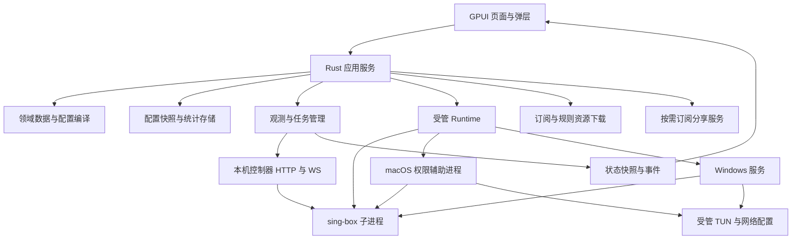

# OpenBox Rust 本地后端与 GPUI 桌面实现方案

日期：2026-10-03

状态：技术方案，尚未实施

首期平台：macOS；保留 Windows、Linux 适配边界

代码基线：`codex/dist-react-restore`，`bda242a920d471b9598f98b57dde5d7c2505c35e`

执行入口：[当前进度](openbox-rust-gpui-tasks/SESSION.md) · [任务总表与验收](openbox-rust-gpui-tasks/IMPLEMENTATION_PHASES.md)。本方案定义技术边界；任务文档记录实施状态，编写完成不代表功能已经实现。

## 1 方案结论

将当前 OpenBox UI 使用的业务接口实现为 Rust 本地服务，以 GPUI 重写桌面界面。保留当前六个主页面、九个设置分类、主要交互及数据含义；订阅、配置、统计和运行状态由本机管理，代理流量继续交给 sing-box。

建议采用以下结构：

- **GPUI 桌面进程**：负责窗口、页面、交互、托盘，以及用户权限下的 Rust 应用服务。
- **Rust 核心库**：负责订阅、节点组、分流、DNS 配置、共享服务配置、持久化、配置编译、内核运行管理和观测。
- **sing-box 子进程**：执行代理协议、DNS 解析、路由和 TUN 数据转发。
- **macOS 权限辅助进程**：在 SystemProxy/TUN 模式下统一管理内核、系统网络修改与恢复；系统代理阶段即可按需安装。
- **Windows 服务**：在 Windows 交付阶段实现，作为高权限辅助进程管理 TUN 内核与系统网络资源；GPUI 保持普通用户权限。

GPUI 通过 Rust 类型化方法调用本地应用服务；普通业务结果和事件通过进程内通道返回。需要高权限的运行操作由平台适配转交 macOS helper 或 Windows 服务。**桌面主界面不需要再通过 HTTP 调用自己的后端**。现有 HTTP 路径作为需求和契约映射依据保留在附录中，迁移的是它们负责的业务。

仍然需要网络端口的地方包括 sing-box 控制接口、代理入站，以及用户启用的共享代理和订阅分享。它们有各自的用途，不能与 GPUI 的业务调用混为一谈。

本方案按两个交付层次推进：先完成可独立使用的 macOS 本机代理版本，再完成当前 UI 中适用于桌面的高级功能。路由器专属能力显示准确的不可用原因；它们不计入 macOS 等价实现，也不通过无效开关制造完成假象。

### 1.1 本次依据与边界

需求主要来自当前 `src/openbox` 下的页面、API client、类型、样式和行为测试；现有 Rust 代码仅用于判断复用范围。没有以历史需求文档推导新功能，也没有将远端后端内部实现视为已经掌握。

本次完成的是方案编写和静态核查，没有运行 GPUI 原型、改写应用代码、调用生产写接口或验证 macOS/Windows 网络权限。文中性能数字、阶段工作量和新增类型均为设计目标。

2026-10-03 用户明确停用旧 SDLC 状态及 UI 门禁。当前路线直接采用 Rust/GPUI 与现有 OpenBox UI/API 基线；不再以补办 DCR、恢复 UI Contract 或逐 Task 人工签字作为实施前置。任务按已声明验收项和真实结果更新；正常测试、实际界面检查与用户明确要求的验收继续保留。

### 1.2 首期采用的具体决策

| 项目 | 决策 |
| --- | --- |
| UI 框架 | GPUI，使用与其版本匹配的 GPUI Kit 组件能力 |
| 首期系统 | macOS，先验证 Apple Silicon；Intel 包必须单独构建和验证 |
| 系统最低版本 | 暂定 macOS 15，依据当前 GPUI Kit 安装说明；在 P0 用锁定版本确认 |
| UI 与业务通信 | Rust 方法调用、类型化结果、事件订阅 |
| 核心运行时 | 每个进程持有一个 Tokio runtime；GPUI 继续使用自己的 UI 调度机制 |
| sing-box 集成 | 独立、固定版本的受管可执行文件；优先验证仓库现用的 1.14.0 |
| 权限宿主 | macOS 使用 helper；Windows 后续使用按需启动的 Windows Service，共享受控操作契约 |
| 配置存储 | 带 schema 版本的 JSON 快照，原子替换 |
| 统计存储 | SQLite，仅承担流量、延迟历史和可用的 DNS 观测记录 |
| 更新分发 | GitHub Releases；无 Developer ID/Authenticode 发布签名、无 Apple 公证，手动安装更新；内核与资源随固定版本交付 |
| 远端 OpenBox 管理 | 不作为首期运行依赖；本方案不同时建设远端管理客户端 |
| 路由器能力 | 通过平台能力明确限制；保留导入的数据，不在 macOS 上错误应用 |

GPUI 官方示例采用 Rust View、`Render`、`Context` 和实体更新来构建界面。GPUI Kit 当前提供控件、主题及测试能力，项目已从 `gpui-component` 名称迁移到 GPUI Kit。实施时锁定一组相互兼容的依赖和 `Cargo.lock`，不能将不同版本的示例混用。参见 [GPUI 官方入口](https://gpui.rs/)、[GPUI Kit 仓库](https://github.com/longbridge/gpui-kit)、[安装说明](https://gpui-kit.com/docs/installation/)。

### 1.3 无开发者账户的分发约束

首期只通过 GitHub Releases 提供安装包，不购买或依赖开发者账户，不做 Developer ID/Authenticode 发布签名和 Apple 公证。更新采用版本检查、下载与手动安装，不引入 Sparkle 或无人值守替换程序。

“无发布签名”与“完全没有任何代码签名”需要区分：Apple Silicon 不执行完全无有效签名的原生 arm64 代码，最低可使用不含开发者身份的 ad-hoc 签名；它不需要证书/账户，也不提供 Team ID 或 Gatekeeper 信任。构建工具可能已经生成此签名，打包时仍须检查最终内嵌二进制与 bundle。若连 ad-hoc 都禁止，则不能承诺原生 Apple Silicon 交付，不能通过移除该约束解决。参见 [Apple Silicon 代码签名要求](https://support.apple.com/en-gb/guide/security/secebb113be1/web)和 [ad-hoc 身份限制](https://developer.apple.com/documentation/security/seccodesignatureflags/adhoc?language=objc)。

从 GitHub 下载后的首次启动须在带 quarantine 的真实下载产物上验证。macOS 可能要求用户在系统设置中确认打开；发布说明写出目标系统上的真实步骤，不要求关闭 Gatekeeper/SIP 或全局移除检查。参见 [Apple 的未识别开发者应用打开方式](https://support.apple.com/en-us/102445)。应用包校验和只用于版本/完整性核对，不等于发布者签名。

不做发布签名也不取消管理员权限：修改系统代理、安装 helper 和启用 TUN 仍按 §11 执行本机授权。macOS 首选管理员一次安装受保护的 launchd helper 与 Unix socket 通信，用户授权边界取代不可用的 Team ID 身份前提；这是待 P0 原型验证的实现方案，不宣称已经通过目标系统验证。

## 2 当前实现事实

### 2.1 前端与后端关系

当前 OpenBox 入口是 `openbox.html` 和 `src/openbox/main.tsx`，根组件为 `OpenBoxApp`。`vite.config.ts:4` 将 `/api` 请求及 WebSocket 转发到远端 OpenBox；`api/client.ts:56` 还允许通过 `VITE_OPENBOX_API_BASE` 指定后端地址。

当前业务请求使用浏览器 Cookie，并发送语言头；401 会触发 `openbox:unauthorized`，根组件重新展示鉴权界面。请求返回值包含空响应、JSON，以及部分宽类型对象。

静态清点得到：

- `api` 对象有 **77 个方法**，其中 `geoIp` 直接请求第三方站点，其余方法覆盖 OpenBox 管理及控制器接口。
- 有 **4 个 WebSocket 通道**：`connections`、`logs`、`memory`、`traffic`。
- `controllerConfig`、`version` 和三个设备管理方法只有 client 定义，没有当前非测试业务调用。
- `deployState` 由 `BackendSettings.helpers.ts` 间接调用，用于远端重启断线后的结果确认。
- 后端设置里的“客户端配置”仍为“即将开放”，按钮禁用；不得把对应接口声明当作已迁移功能。

77 是客户端方法数量，不是唯一 URL 数量：一个方法可能按参数形成多个路径，也可能与另一个方法共享同一路径。

### 2.2 页面到业务映射

| 页面 | 当前用户操作 | Rust 服务 | GPUI 实现重点 |
| --- | --- | --- | --- |
| 概览 | 实时指标、站点测速、延迟走势、月日小时流量、按节点/域名/终端下钻 | Observation、Latency、Traffic、Preferences | 图表、日历或日期选择、下钻面板、直接流量开关 |
| 代理 | 策略组/节点组/订阅视图、节点选择、单个/分组测速、搜索、排序、展开与穿透 | Proxies、Subscriptions、Groups | 节点卡片、局部忙碌、卡片主体与测速按钮分离 |
| 连接 | 活动/已关闭连接、搜索排序、多列分组、列设置、详情、断开、IP 归属、关联策略切换 | Observation、Proxies、GeoIp | 虚拟表格、稳定行 ID、详情抽屉、选中状态保持 |
| 日志 | 级别、类别、正则筛选、暂停接收、清空、导出 | Logs | 虚拟列表、文本选择、错误正则提示、暂停语义 |
| 规则 | 已加载规则、规则穿透、内核真实访问诊断、终端模拟能力提示 | Routing、Diagnostics、Capabilities | 五阶段诊断、预测与实测分区、部分结果及不可用状态 |
| 设置 | 九个分类及各自弹窗 | 下表对应服务 | 横向分类导航、保存反馈、统一弹层和焦点管理 |

### 2.3 九个设置分类

| 分类 | 必须覆盖的内容 | 保存或执行方式 |
| --- | --- | --- |
| 面板设置 | 语言、主题、背景、透明度、模糊、圆角、测速站点与阈值、IP 信息源、代理显示设置 | Preferences 字段更新；滑块先本地预览再合并保存 |
| 订阅管理 | URL/多 URL/粘贴节点、预览、重命名、排除/禁用、自动更新、节点 DNS、刷新、分享链接及二维码 | 预览无副作用；保存后更新规范化节点快照 |
| 出站节点 | selector/urltest/failover、静态与动态成员、国家分组、图标、拖拽、主备线路 | 整组编辑校验；返回有效组及 dropped/dangling 信息 |
| 目标分流 | 策略顺序、自定义规则、域名/IP/Geo/URL 规则集、出口、兜底、恢复默认 | 按 routing 子结构更新，编译时保留顺序和目标引用 |
| 终端分流 | IP/MAC 匹配、已知终端、指定出口、入口旁路/准入、排序 | macOS 只应用真实能获得来源的规则；MAC 和入口策略受能力限制 |
| 链式代理 | 链路配置、上游选择、连通性、出口 IP、启停、编辑排序 | 规范化链路节点，编译为受控 detour，检测循环 |
| 共享网络 | Shadowsocks/VLESS/TUIC/Hysteria2/mixed、端口检测、凭据、地址、URI/二维码 | 配置校验和端口预检；应用时由 sing-box 实际绑定 |
| DNS 设置 | 直连/代理上游和备用、先测试再保存、模式/FakeIP、重写、过滤列表、允许域名、应用、记录与预览、清缓存 | 配置保存与生效分开；观测和热更能力必须实际验证 |
| 后端设置 | 服务启停、版本、更新、IPv6、节点直连、QUIC、入口旁路、TUN、测速 URL、保留周期、备份恢复、诊断、重置 | Runtime、Profile、Update、Backup；危险操作保留明确确认 |

## 3 需要保留的行为契约

### 3.1 配置与运行状态

“保存成功”只说明数据落盘；“已生效”表示对应配置已被当前运行实例接受。两者必须分别显示。

当前多数分流、共享服务及后端设置保存后提示重启；代理选择可通过控制器切换。DNS 重写代码则区分修改目标/备注与修改来源/启停。Rust 版本由服务返回实际的 `ApplyEffect`，GPUI 不自行根据按钮推测结果。

`serviceAction` 即使 HTTP 成功，也可能返回 `ok: false`。启动成功需要同时满足子进程存活、控制接口就绪以及配置身份一致；任务被提交不算启动成功。

### 3.2 并发和失败反馈

- 订阅预览、规则集搜索、DNS 分页、链路测速使用请求代次，旧结果不得覆盖最新输入。
- 代理测速结果合并到对应节点，不能用旧代理快照覆盖用户刚选中的线路。
- 自动保存串行合并字段；只更新本次修改的字段，保留未编辑的 DNS、routing、TUN 内容。
- 保存失败保留用户可修正的草稿，并展示失败原因；不得显示成功 Toast 后再静默回滚。
- “未测”“超时”“失败”“零值”分别建模。部分失败保留成功项，显示失败数量及原因。
- 服务停止、重启、重置和更新共享同一运行操作互斥边界，防止重复启动或相互覆盖。

### 3.3 现有测试中的重点

以下行为应转成 Rust 和 GPUI 的回归用例：

1. DNS 上游测试失败不保存；每侧最多四个上游；只发本次 DNS patch。
2. DNS 重写恢复默认保留自定义规则，避免重复来源域名。
3. 节点自动组只使用后端确认存在的节点；保留手工排序和新增成员。
4. failover 保存主备 `lanes`、阈值、恢复主线路及稳定时间。
5. 规则导入保留来源 URL，过滤不支持项，维持 UI 当前的导入数量约束。
6. 共享网络字段随协议变化；mixed 用户名和密码成对；IPv6 分享地址加方括号。
7. 备份先预览内容；订阅 append/replace 与其他配置覆盖语义分开；导入后的刷新允许部分失败。
8. 诊断无观测结果时显示“结果不完整”，终端模拟不可用不能伪装成实测。
9. 日志暂停期间不补入暂停时的日志；当前浏览器实现最多保存 1000 条。
10. 当前连接页面的已关闭历史最多 100 条；新快照保持活动行和历史行去重。

测试保护行为结果，不能机械翻译现有基于 TSX 字符串的结构断言。

## 4 总体架构



图中的 macOS 与 Windows 分支按目标平台选择。macOS 纯手动代理由 desktop 管理 child，SystemProxy/TUN 由 helper 同时管理 child 与网络修改。Windows 的普通代理及当前用户系统代理仍由 desktop 管理，TUN 由服务管理。控制器调用与事件采集跟随实际 owner，桌面通过平台适配获得结果，同一实例始终只有一个 owner。helper 管理进程不等于内核必须以 root 运行，具体权限见 §11.1。

### 4.1 模块边界

**UI 层**持有页面选择、输入草稿、筛选、滚动、焦点和弹层状态，不保存第二套业务事实。

**应用服务层**组织一个用户操作：如预览订阅、保存分流、应用配置。它负责校验、版本判断、持久化及调用运行管理。

**领域和 Compiler**使用稳定的节点/订阅/组/策略 ID，解析展示名与引用，输出受控的 sing-box 配置和运行资源计划。

**适配层**处理 HTTP、WS、磁盘、系统代理和进程。只有这里了解平台 API、sing-box 路径和实际控制器端口。

不为每个页面建立一个 crate，不引入通用 RPC 框架、插件体系、服务发现或远程数据库。实际边界上的 trait 优先复用现有定义；纯内部逻辑用普通结构体和函数。

### 4.2 建议目录

以下为实施目标，当前仓库尚无这些新 crate：

```text
Cargo.toml                         # 根 workspace
crates/
  veyra-core/
    src/
      application/                # 用户操作及服务入口
      domain/                     # 配置、节点、策略和运行结果
      subscription/               # 获取、解析、规范化、重命名
      compiler/                   # domain -> sing-box
      runtime/                    # 启停、健康状态、控制器、观测
      storage/                    # JSON 快照、SQLite 查询和迁移
      platform/
        macos/                    # 系统代理、路径、helper 客户端
        windows/                  # 系统代理、已有进程适配、Named Pipe 客户端
        linux/                    # 后续实现
  veyra-desktop/
    src/
      main.rs
      app.rs                      # 装配、窗口、托盘、关闭流程
      ui/
        theme.rs
        components/
        pages/
        settings/
      assets/
  veyra-helper/                    # P0 验证，P2 系统代理阶段引入，P6 扩展 TUN
    src/main.rs
  veyra-service/                   # Windows 交付阶段引入，含服务注册命令
    src/main.rs
src/openbox/                       # 迁移期间的行为和视觉对照
src-tauri/                        # 迁移期间保留旧入口及原有测试
```

core 独立于 GPUI、Tauri。desktop 是 composition root，持有 `Arc<AppServices>`、Tokio runtime 和 UI 实体。helper 和 Windows 服务复用同一受控配置校验，不接受任意 shell 命令。两者分别实现平台入口，不运行 GPUI，也不加载订阅编辑和面板设置等界面业务。

### 4.3 端口与进程归属

| 用途 | 默认绑定 | 谁创建与关闭 | 对外范围 |
| --- | --- | --- | --- |
| GPUI 业务调用 | 无端口 | desktop/core | 进程内 |
| sing-box 控制器 | loopback，由内核实际 bind 确认端口 | Runtime 管理的实例 | 本机、鉴权 |
| 本机 mixed 代理 | loopback | sing-box | 本机应用 |
| 共享代理入站 | 用户选择的网卡地址及端口 | sing-box | 用户明确启用的网络 |
| 订阅分享 HTTP | 显式启用后监听指定地址 | ShareService | 分享 token 对应的只读资源 |
| helper 通信 | 本地 Unix domain socket，受保护目录与对端用户身份校验 | macOS launchd helper | 经本机管理员授予控制权的用户 |
| Windows 服务通信 | 仅本机的 Named Pipe，显式 ACL | Windows 服务创建，SCM 管理服务生命周期 | 获授权的本机用户与服务 |

不会为了运行 GPUI 自动启动 OpenBox Web 面板服务。订阅分享接口也不承载服务启停、导入或系统配置能力。

控制器端口首选让内核绑定 `127.0.0.1:0`，从受管 child 的启动日志取得实际地址，再用本实例 secret 完成就绪探测。sing-box 1.14.0 的[控制器源码](https://github.com/SagerNet/sing-box/blob/v1.14.0/experimental/clashapi/server.go)使用 `net.Listen` 并输出实际监听地址，这为方案提供了源码依据；P0 仍须验证打包版本、日志格式、超时和地址解析。地址只从本实例受管输出接收，不能通过扫描本机端口发现实例。

如果锁定版本无法可靠返回动态端口，则采用有界候选端口启动，以内核实际 bind 结果为准；仅在确定 `AddressInUse` 且本次 child 已清理后换候选端口，总预算耗尽返回 `PortInUse`。探测空闲后释放再启动仍有竞争；父进程预占只有在内核支持监听句柄交接时才有效，不为此增加未经验证的 socket activation。用户显式指定的代理/共享端口冲突直接报错，不自动改端口。

## 5 现有 Rust 的复用策略

仓库已有订阅解析、领域状态、JSON 存储、配置编译、受管 sidecar 和观测实现。它们具有复用价值，但契约与 `OpenBoxProfile` 不完全相同，当前平台目录也只声明了 Windows 适配。

| 现有位置 | 复用内容 | 必须补齐或隔离 |
| --- | --- | --- |
| `crates/veyra-core/src/subscription/` | 下载、JSON/YAML/URI/Base64 解析、规范化 | 多 URL、OpenBox 重命名/排除/禁用、nodeDns、错误条目展示的差异 |
| `crates/veyra-core/src/domain/` | 稳定身份、节点、路由等领域概念 | OpenBox 的分组、链路、DNS、服务配置字段；逐项映射 |
| `crates/veyra-core/src/storage/` | schema 迁移、校验、原子写、备份恢复 | 新桌面 schema；不得直接将旧 `StoredStateV6` 当 OpenBox profile |
| `crates/veyra-core/src/singbox/compiler.rs` | 封闭配置模型、最终校验、secret 注入 | 当前 UI 所需的 DNS、共享入站、failover 编排、规则资源 |
| `crates/veyra-core/src/singbox/runtime.rs` | `SidecarPort`、check/prepare/run/ready/stop、失败清理 | macOS 进程、资源定位和权限实现 |
| `src-tauri/src/singbox/clash_api.rs` | 控制器通信、鉴权、可复用 DTO | UI 需要的代理/连接/规则/测速及实际数据单位 |
| `src-tauri/src/application/` | 配置应用、订阅管理、调度和观测逻辑 | 去掉 Tauri 运行时和事件绑定；核查旧模型限制 |
| `src-tauri/src/platform/windows/` | Windows 进程、Job Object、私有运行目录及代理归属实现 | 抽离 Tauri 依赖；补服务入口、IPC、提权安装和服务账户适配 |
| `src-tauri/src/lib.rs`、`commands.rs` | 业务调用关系的参考 | Tauri 窗口、invoke、tray、事件桥由 GPUI 入口替换 |

实施顺序是先抽出一个可编译、可测试的核心库，再使旧入口依赖它。每次只移动当前阶段需要的代码和对应测试，避免先做整仓重构。现有测试仍有效的部分继续保留。

P1 先处理当前真实耦合：`subscription_scheduler.rs` 使用 Tauri 的 spawn/JoinHandle，`managed_observation_runtime.rs` 使用 Tauri block_on 和具体 Windows sidecar，`application/runtime.rs` 从 Windows 模块引入系统代理契约。调度改为应用持有的 Tokio runtime/Handle，业务签名使用 Tokio 类型；平台无关的 `SidecarPort`、`SystemProxyController` 契约移到公共边界，具体平台实现由桌面入口装配。不增加通用 Executor，也不先搭一套平台工厂。

P1 验收要求 `veyra-core` 在 macOS 上脱离 Tauri/GPUI 独立编译并运行相关纯单测，依赖树不包含 Tauri，公共业务路径不引用 Windows 实现。已有 Windows 代码通过目标平台条件编译保留；“能独立测试”不等于要求一次运行所有会启动真实 child 的测试。

当前 `tauri.conf.json` 打包的是 Windows 的 sing-box 1.14.0 资源；不能据此声称已经有 macOS sidecar、可用的 macOS Runtime 或安装包。

## 6 Rust 本地接口与状态模型

### 6.1 服务入口

建议按业务组合服务，例如 `subscriptions.preview()`、`profile.patch()`、`runtime.restart()`、`traffic.day()`。GPUI 接收明确类型，不使用包含任意 JSON 命令的统一 `invoke(name, payload)`。

以下为领域签名草案，不是已经可编译的 SDK：

```rust
pub struct StateVersion {
    pub epoch: Uuid,
    pub revision: u64,
}

pub struct SaveOutcome<T> {
    pub value: T,
    pub version: StateVersion,
    pub effect: ApplyEffect,
    pub warnings: Vec<UserWarning>,
}

pub enum ApplyEffect {
    SavedOnly,
    Applied,
    RestartRequired,
}

pub struct RuntimeSnapshot {
    pub status: RuntimeStatus,
    pub instance_id: Option<InstanceId>,
    pub saved_version: StateVersion,
    pub applied_version: Option<StateVersion>,
    pub last_successful_version: Option<StateVersion>,
}

pub async fn save_profile(
    &self,
    expected_version: StateVersion,
    patch: ProfilePatch,
) -> Result<SaveOutcome<Profile>, AppError>;
```

实际代码应位于具体服务的 `impl` 中。这里展示数据关系，不提前绑定 GPUI 版本相关的调用签名。

### 6.2 数据类型原则

- `SubscriptionId`、`NodeId`、`GroupId`、`RuleId`、`OutboundId` 保持稳定；显示名可以改变。OpenBox 以名称引用的成员在导入边界解析为 ID。
- 网络输入、备份输入允许暂存未知字段并给出兼容性报告；进入编译模型后只允许已支持字段。
- 不把 TS 的 `[key: string]: unknown` 转成贯穿内部业务的 `serde_json::Value`。
- `ProfilePatch` 区分未提供、清空、设值；嵌套对象合并允许字段，数组明确采用整体替换。可空字段需要 `Missing/Null/Value` 等明确表示。
- API 的时间戳单位在导入边界统一为 UTC 时间；显示和统计日界使用明确的时区。
- 端口使用有范围的整数，IP/CIDR 使用解析后的类型；字符串正则只作 UI 输入提示。
- `kernelStale` 从已保存和已应用配置关系推导，不能只复制远端字段。
- 更新进度、服务操作和诊断都有独立结果类型；错误与警告分别返回。

#### 6.2.1 状态版本与整体替换

一个业务快照共享一个持久化 `state_epoch`，`config_revision`（配置）与 `selection_revision`（选择）各自递增；saved/applied revision 表示对应配置版本的已保存/已应用位置。本文的 `saved_revision`、`applied_revision` 和 `selection_revision` 均是同一 epoch 内的计数简称；跨快照比较必须使用完整 `StateVersion`，不能仅比较数字。

备份恢复、替换型导入、恢复出厂或整份快照回退时生成新 epoch；不沿用备份中的并发版本。普通 patch、追加导入和不替换状态空间的 schema 升级只推进相关计数。整体替换先暂停写入并处理在途提交，换 epoch 后拒绝旧任务的写回；不为每个实体再加一套 epoch。

配置/选择写操作携带预期版本；页面读结果按既有请求代次丢弃过期响应；内核事件仍按实例 ID 判断。数据替换后若旧实例暂时继续运行，UI 显示其旧 `applied_version`，它不能回写新业务状态。实例清理凭实际实例身份执行，不因 epoch 改变而遗失旧资源归属。

P1-02 已交付的本地实现见[类型/快照记录](openbox-rust-gpui-tasks/P1-core-and-shell.md#p1-02-delivery)：schema v7 在既有 AppState 中保存一个 128-bit 随机 `StateEpoch`、两个独立计数、受支持的 Profile 子集及 AppConfig；`ConfigVersion`/`SelectionVersion` 分别封装 StateVersion，整体写入使用 SnapshotVersion。新 epoch 的两个计数从 0 开始；相同事实的 no-op 不推进计数。旧 pool 的手动选择继续作为单一选择事实，不新增一份平行 selection 数据。ProfileService、SelectionService、SnapshotService 共用现有 StateAccessGate/JsonStateStore；本卡的保存结果统一为 SavedOnly，不启动内核、不给 Applied/RestartRequired 的运行证明。RuntimeFacts/LastSuccessfulVersion 是实际 Runtime owner 的读写契约，尚未实现 §7.6 manifest 持久化。

#### 6.2.2 派生出口目录与偏好边界

P2-02A 先交付 Base OutboundCatalog/OutboundId，至少包含 Node、implicit provider/subscription group、首个闭环所需 selector/urltest 语义、Direct、Block。Domain 使用 Direct / Block，外部/内核 reject 仅在导入/适配边界映射为 Block。P2-02B 的最小 Compiler 负责将目录语义编译成 sing-box，不拥有第二份出口定义；P4 按注册契约扩展为 **Unified OutboundCatalog = Base OutboundCatalog + Group/Failover + ChainProxy**。目录由配置事实派生、不另存一份编辑真相，统一负责 self/cycle/dangling 校验，供 Routing/Client Routing/Rules/Connections/Proxy UI 使用。P3 只验收基础代理视图和已加载规则，完整目录消费在 P4 集成，Rules 的 DNS 完整诊断在 P5 闭合。

P1-04A 交付视觉桌面偏好，包含 sidebar 折叠/展开及 layout 类纯视觉布局；P1-04B 交付 proxy columns、hide unavailable 等跨页面行为偏好。UI latency preference test URL、Runtime health test URL、group health URL 是三种独立语义；group 空值仅按既有规则继承 Runtime 全局 health URL，不合并为 UI 测速偏好。UI diagnostics `config/ipv6-test` 与 Runtime profile `ipv6` 分别建模和消费，诊断选项不改变运行配置。

### 6.3 错误分类

`AppError` 至少包含稳定错误码、用户信息、可选字段位置和供日志使用的脱敏详情。需要覆盖 `Validation`、`RevisionConflict`、`UnavailableOnPlatform`、`PermissionDenied`、`PortInUse`、`KernelUnavailable`、`Timeout`、`Cancelled`、`DownloadFailed`、`StorageFailed` 和 `ApplyFailed`。

只有用户能执行下一步动作时才展示“重试”“授权”“修改端口”等操作。错误不通过返回空列表或零流量伪装成正常结果。

### 6.4 超时和取消

| 操作 | 当前可见事实 | 新实现建议 |
| --- | --- | --- |
| 普通本地查询 | 大部分 client 请求没有统一显式超时 | 本地短读不加任务框架；跨进程/网络查询使用 5 秒初始预算 |
| 统计下钻等长查询 | 页面切换和筛选可能使结果过期 | 有界后台读任务、请求 ID、SQLite 中断；取消只影响该读请求 |
| 节点测速 | timeout 来自用户设置，默认 5000 ms | 尊重用户值，外层增加短清理预算；限制并发 |
| 站点/链路测速 | client 外层 30 秒 | 保留 30 秒整体预算，允许取消 |
| 规则集刷新 | client 外层 120 秒 | 保留有界下载和解析；显示进度 |
| DNS 过滤应用 | client 外层 300 秒 | 拆分下载、解析和切换；最长预算初始为 300 秒 |
| 内核启停 | 远端重启有 90 秒断线恢复流程 | 本地操作使用自己的 operation ID 和真实结果，不能照搬断线恢复轮询 |

取消只在安全点生效。配置已经提交或内核已经切换后，关闭弹窗不撤销操作；UI 应展示当前任务结果。读请求取消不会取消全局共享的内核或订阅任务。

“本地短读”指内存快照或有索引的少量读取，不包括统计下钻。长查询独占一个可中断的读连接，连接归还前等待该查询结束；通过 SQLite interrupt 或 progress handler 取消，不能只丢弃 Rust future 后声称 SQL 已停止。取消不作用于统计 writer 或其他页面的连接。已接近结束的查询可能正常完成，UI 仍按请求 ID 丢弃过期结果。参见 [SQLite 查询中断语义](https://www.sqlite.org/c3ref/interrupt.html)。

## 7 配置编译和生效流程

### 7.1 单一配置来源

持久化配置是用户意图；Compiler 输出的配置是派生物；运行实例记录自己使用的 revision。UI、规则预览和运行管理使用同一规范化数据及排序规则。

编译流程：

```text
订阅原文 / Profile / Groups / DNS Filter
    -> 解析与字段校验
    -> 稳定 ID、引用解析、循环检查
    -> 节点、组、链路、规则、DNS、入站的规范化模型
    -> 平台能力校验
    -> sing-box 配置与资源清单
    -> sing-box check
    -> 实例启动或允许的局部应用
    -> 控制器就绪与 revision 确认
```

### 7.2 字段落地关系

| 当前配置 | Rust 处理及输出 | macOS 注意事项 |
| --- | --- | --- |
| groups selector/urltest | 生成对应出站及成员引用 | 名称仅作展示，tag 稳定 |
| groups failover/lanes | 有序主备线路编排，底层 selector 与测速结果 | 不能把 failover 无条件转换成 urltest |
| routing policies/custom/fallback | 生成顺序规则和最终出口 | 域名与 IP 匹配规则需统一用于预览和编译 |
| chainProxies | 节点出站的 detour 关系 | 自引用、组间循环必须拒绝 |
| servers | 对应 sing-box 入站及 TLS 资源 | 端口、网卡地址和证书必须可用 |
| dns 上游及策略 | 固定版本支持的 DNS server/rule 模型 | 代理 DNS 的路径必须跟随选定出口 |
| dns rewrite / filter | 域名匹配、预定义响应或拒绝规则与受管规则集 | 热更新和查询记录分别判定能力 |
| ipv6 / ipv6Proxy | DNS 策略与出站规则共同实现 | 不能以关闭一个 UI 开关等同修改全机 IPv6 |
| rejectQuic | 对应代理路径上的拒绝规则 | 保留直连路径语义；不扩展成所有 UDP 禁用 |
| directForNodes | 内核侧节点直连和引导解析规则 | Rust 自身下载另按 §8.9 处理，不能由此推断 reqwest 出站策略 |
| 内核运行缓存 | 生成 `experimental.cache_file`，启用缓存并指定受管绝对路径 | 与业务配置、统计库分离；FakeIP 启用时设置 `store_fakeip`，见 §7.5 |
| tun stack/mtu/tcpMss | 根据已锁定内核支持的字段或平台操作编译 | 不存在对应字段时拒绝启用，不能静默忽略 |
| directBypass/bypassPorts | 内核之前的入口策略 | macOS 首期不等价支持，详见平台矩阵 |
| traffic.keepMonths | 统计数据清理策略 | 取值沿用 1 至 36 个月 |
| updates.openbox | 导入为桌面更新偏好 | 不执行路由器升级脚本 |

sing-box 的 `auto_redirect` 官方限定在 Linux 使用；不能映射为 macOS 上一个同名可用开关。DNS 的 `predefined` 动作可作为固定记录响应的构件，但它本身不证明完整 OpenBox DNS 行为已实现。参见 [TUN 配置](https://sing-box.sagernet.org/configuration/inbound/tun/)、[DNS Rule Action](https://sing-box.sagernet.org/configuration/dns/rule_action/)。

### 7.3 保存与应用

1. 校验当前 epoch 和预期 revision 上的 patch，生成完整候选模型。
2. 对可编译配置进行静态校验，保存成功后增加 revision。
3. 返回实际 `ApplyEffect`，保存与应用按现有页面动作区分。
4. 需要重启时生成候选文件并先运行 `sing-box check`。检查失败保留当前运行实例。
5. 切换前保留上一份已经验证的运行配置、资源引用和已确认选择状态；缓存按 §7.5 在旧实例退出后取得一致快照。
6. 停止旧实例，确认退出和端口释放，再启动新实例；不假设两个占相同端口的实例能够同时运行。
7. 新实例就绪、选择对账和本次网络接管确认完成后，更新实际 `applied_version` 并原子提交 §7.6 的最后成功配置记录。启动失败时尝试一次有记录的旧配置恢复；恢复失败显示停止状态及具体错误。

内核停止后，仍可编辑、保存、导入和预览。运行相关按钮明确显示“需要启动内核”。应用失败不删除用户已保存的新配置，界面继续显示“已保存，尚未生效”。

保存时完成字段、引用和可确定的编译约束校验；`SavedOnly` 表示这些校验通过且已持久化，尚未应用。`sing-box check` 放在显式应用/启动候选配置前，结果绑定具体内核和资源。普通保存不启动内核检查，也不依赖 helper 授权；“已保存”与“通过当前内核检查”分别展示。

### 7.4 生效粒度

| 修改 | 目标行为 |
| --- | --- |
| 主题、列表偏好、备注 | 本地立即更新并持久化 |
| selector 当前节点 | 经唯一选择写入入口切换；控制器确认后更新实际选择并保存运行偏好；失败保留旧选择，见 §8.2 |
| 订阅刷新、组结构、分流结构、共享入站、TUN | 保存后标记待应用；按统一流程检查和重启 |
| 规则集内容 | 只有验证过当前内核热加载机制时才能标记即时生效 |
| DNS 重写目标/备注 | 当前 UI 期望无需重启；必须在 P0 证明实现路径，或明确记录首期差异 |
| DNS 重写来源/启停/条目变化 | 按当前 UI 保留待应用状态 |
| DNS cache 清理 | 调用已验证的缓存清理能力，不能用清空 UI 记录代替 |

### 7.5 内核缓存与重启恢复

Compiler 显式输出 `experimental.cache_file.enabled = true`、受管绝对 `path` 和稳定的 `cache_id`；启用 FakeIP 时同时设置 `store_fakeip = true`。不生成已经迁移的 `experimental.clash_api.store_selected` 等旧字段。官方文档说明启用 cache file 后可保存 selector 选择，FakeIP 持久化需要单独开启；参见 [Cache File](https://sing-box.sagernet.org/configuration/experimental/cache-file/) 和 [Clash API 缓存字段迁移](https://sing-box.sagernet.org/configuration/experimental/clash-api/#store_selected)。

三类状态分别承担不同职责：

| 状态 | 权威来源与恢复方式 |
| --- | --- |
| Profile、组结构与用户策略 | 业务快照与 `saved_revision`；按 §7.3 编译和应用 |
| 手动选择、自动/手动覆盖模式、最后确认的主备线路 | Veyra 的 `selection_state`；使用独立 `selection_revision`，不让自动切换制造配置待应用提示 |
| selector 内核缓存、FakeIP 映射 | sing-box 独占的 `cache.db`；Veyra 管理路径与生命周期，不直接修改其内部格式 |

`cache_file` 不知道 Veyra 的失败阈值、恢复计时和手动覆盖含义，不能代替 failover 状态管理。重启恢复有效的选择意图与最后线路；失败计数归零，恢复保持时间从新的健康观测重新计算，不把过期测量当作当前健康结果。

缓存目录按用户/profile/内核兼容代际隔离，路径不随每次 instance ID 或普通 revision 改变；同一文件同时只有一个内核 writer。稳定 outbound tag 由稳定 ID 生成，重命名不丢选择，删除目标则报告失效并使用组内明确的默认候选。

配置切换时先停止旧 writer，再复制关闭后的缓存作为回退快照；候选启动期间产生的缓存不能覆盖上一份回退资料。回退恢复的是旧运行配置、兼容的选择快照和对应缓存。不得复制仍打开的数据库，也不把 cache.db 当作 SQLite 用业务迁移代码改写。内核版本或 FakeIP 地址池变化必须验证缓存兼容性；不兼容时创建新缓存代际，并说明连接与 DNS 状态的处理，不能静默删除映射后宣称会话连续。

内核缓存是启动加速与恢复材料，业务选择仍以 Veyra 已确认状态为准。1.14.0 的 [selector 实现](https://github.com/SagerNet/sing-box/blob/v1.14.0/protocol/group/selector.go)优先读取有效的缓存选择，且缓存写失败会记录日志，因此控制器切换成功不能被当成持久化成功。启动时须读取实际选择并与 `selection_state` 对账；完成之前不报告应用就绪、不打开新的系统代理接管。TUN/共享入站启动到选择对账之间可能已有流量，P0 须验证恢复次序；无法保证时明确这一窗口，不承诺原子无缝切换。

桌面直接管理模式与权限宿主之间切换时，只允许在旧 writer 退出后迁移受管缓存，并重建目标目录权限；helper/服务不能接受任意用户路径。FakeIP 跨 owner 连续恢复必须单独验证，未通过前不开放需要该保证的模式切换组合。备份默认携带已确认的业务选择，不包含 pending 操作、运行缓存和进程身份；恢复出厂先停止 writer，再删除本应用缓存。

### 7.6 最后成功配置与恢复入口

实际 Runtime owner 在自己的受管目录保存 `runtime/last-applied.json`。它绑定完整配置版本、应用时确认的选择版本及恢复资料、内核版本/摘要、编译格式版本、生成配置摘要、资源引用/摘要和缓存兼容代际（与业务 state_epoch 分开）。配置及资源先完整写入并持久化，再原子替换 manifest；这里只保留最后成功版、切换所需的一份回退资料和在用候选。

`sing-box check` 成功只能证明候选可被该内核接受。新实例 Ready、选择对账和本次要求的系统代理/TUN 状态确认后，才提升为最后成功配置。manifest 写入失败时仍如实显示当前运行版本，同时报告“运行成功，恢复记录保存失败”，保留旧 manifest，不提前清理回退资料。

恢复材料包含可重建配置的规范化计划和对应资源，不从最新 `state.json` 猜测旧配置。新启动重新分配端口、secret 和实例 ID，重新 check 与确认就绪；旧 PID、旧端口或旧 Ready 标志不构成当前运行证明。生成文件摘要属于具体启动产物，重建后的摘要须重新记录。后续单纯的节点选择按 §8.2.1 保存，不为每次选择复制整份配置；恢复时合并同 epoch、仍兼容该运行配置的已确认选择。

例如已保存 revision 12、最后成功应用 revision 11：重新打开且内核未运行时显示“已保存 12；最后成功应用 11；已停止”，`applied_version = None`。用户选择“恢复上次运行”使用 11；选择“应用已保存配置”则检查并启动 12。没有最后成功记录时提示应用已保存配置。不同 epoch、资源缺失或内核不兼容的旧记录不自动启动；整体替换后的当前数据不会被旧配置静默覆盖。

manifest 跟随实际 owner 保存，GUI 通过快照读取状态，不再维护另一份权威记录。macOS desktop/helper 或 Windows desktop/service 交接时，只有旧实例与网络资源完成清理后才能使用其受控恢复材料启动新实例；旧 manifest 仍是历史记录，不能被另一 owner 自动启动。它与用于清理现存进程的实例身份记录分别管理。

P2-04 的恢复格式为 schema/compiler/recovery version 1：`last-applied.json` 保存配置版本、计划编译时的 `plan_selection`、本次应用确认的 `selection_at_apply` 和可轻量前进的 `confirmed_selection`，以及固定内核 version/SHA256、pre-finalize plan 相对引用/SHA256、具体启动 config SHA256、cache generation/快照引用和资源摘要列表。凭据只进入独立 0600 recovery plan，manifest 不保存 PID/端口/secret/Ready；目录 0700。恢复读回 deny_unknown 的 Compiler 封闭模型并校验 index、epoch、内核、版本与摘要，重新绑定受管 cache 路径、生成 secret、请求动态端口并重新 check/Ready/selection reconciliation。当前产品无外部资源，非空资源列表拒绝恢复；FakeIP/owner 交接属于后续任务。

正式命令为 `ApplySaved` / `RestoreLastSuccessful`，既有 `Start` 在停止状态等价 `ApplySaved`，Ready 时仍幂等。Sidecar 分段为 `prepare_replacement` → `stop_old_writer`（Platform 已 wait/reap）→ Runtime opaque cache snapshot → `run_prepared`。首次 cache 由 owner 预建 0600 空文件，防止固定内核默认创建 0644；不能修补正在写入的旧 cache。snapshot 失败阻止 candidate run并返回专门错误；候选运行/对账失败只尝试一次兼容旧计划与快照的回退。最终 manifest 失败不撤销新 Ready/applied，旧 last-successful 与回退材料保留；成功提交后才清理过期且摘要正常的工件，损坏材料保留诊断副本。

### 7.7 固定内核的配置样本

以实际发布的 sing-box 版本及编译特性约束 Compiler。当前资源线索指向 1.14.0；该版本已移除旧 DNS server 格式和旧 `dns.fakeip` 配置，迁移不能只改版本号。参见官方 [Legacy DNS server](https://sing-box.sagernet.org/configuration/dns/server/legacy/) 和 [旧 FakeIP 配置](https://sing-box.sagernet.org/configuration/dns/fakeip/)。

围绕已有 UI 维护少量代表性输入及预期输出：直连/代理 DNS、当前格式的 FakeIP 配合 cache_file/TUN、规则集过滤与重写，以及 UI 的 IPv6 策略。一个样本可覆盖多个有关联的字段，不建立所有开关的组合矩阵。样本由真实 Compiler 生成，断言关键字段和已移除字段不再出现，再用锁定二进制执行 `sing-box check`。

P0 只用代表性最小配置判断路线可行性；P2/P5 随对应功能加入 Compiler fixtures。升级内核时重跑这些样本，只有发现影响 Veyra 配置或用户操作的差异才增加覆盖，不重复认证 DNS 或 TUN 的协议实现。

## 8 各项后端业务实现

### 8.1 订阅与节点

复用现有 parser 和 normalize。接收 URL、多 URL 和粘贴内容，输出 `SubscriptionPreview` 对应的成功、跳过、排除、禁用和重命名结果。预览不创建订阅、不写运行配置。

保存流程需要稳定关联订阅 ID 与节点 ID。刷新后按订阅和规范化协议身份匹配节点，保留可确认的手工覆盖；无法匹配的成员进入 dangling 提示，不把同名异节点自动替换。

多 URL 的顺序、重复节点策略、重命名模板及节点 DNS 以当前 UI 负载和脱敏样本固化为测试。来源凭据、URL query 和节点密码不能进入普通日志。

定时更新使用应用现有调度思路，只在应用运行时执行。睡眠唤醒后至多合并执行一次错过的更新；不补跑每个遗漏周期。应用关闭时不承诺后台刷新。

对未启用或尚未应用的节点测速，可以启动独立受管临时配置；临时实例使用独立端口、目录和缓存，并在成功、超时、取消路径清理。不能为了预览测速替换主实例或打开主实例 cache.db。

### 8.2 节点组和 failover

静态组保存成员顺序。动态组按当前关键词规则计算真实订阅节点，排除禁用节点，返回可用节点和组列表。引用链必须无环，组名冲突和删除后的悬空引用在保存结果中明确展示。

failover 是现有 UI 的业务能力，需在 Rust 实现有限的主备编排：

1. `lanes` 顺序决定优先级；每条线路生成自己的 selector/urltest 子组。
2. 通过现有测速能力按配置间隔观测当前线路。
3. 连续失败达到 `failureThreshold` 后切换至首条可用备线。
4. `restorePrimary` 开启时，主线路持续恢复达到 `recoveryHoldMs` 才切回。
5. 所有线路不可用时保留失败状态，不伪造低延迟或自动改为直连。
6. 应用自己的探测状态只编排选择；不重写 sing-box 的 URLTest 算法。

具体“失败一次”的判定以测速结果定义，并用模拟时钟测清楚阈值、切换和恢复。远端未提供的边界行为需要在 P0 样本记录中确认，不能宣称算法逐行等价。

#### 8.2.1 选择写权与手动覆盖

当前 `ProxiesPage.tsx:118` 直接提交 `selectProxy`，`GroupSettings.tsx:392` 又允许线路选择“自动优选/手动选择”。这些界面事实不足以证明远端的冲突处理方式。以下为本地实现的明确规则，P0 对照样本记录差异：

| 对象 | 唯一写入者与手动操作含义 |
| --- | --- |
| 普通 selector | 用户请求通过 Runtime 的选择入口串行写入 |
| failover 外层 selector，Auto 模式 | 仅编排器按健康结果决定线路 |
| failover 外层 selector，ManualPin 模式 | 用户指定线路或明确的组内目标，暂停该组自动换线；UI 显示“手动固定”和“恢复自动” |
| 线路内 `manual = true` 的 selector | 用户控制线路内节点；这不自动暂停外层的主备切换 |
| 线路内自动 urltest | 由 sing-box 选择；改为手动须先修改线路模式，不能同时由编排器和用户写同一个 selector |

只设置一个受串行约束的选择入口，UI、编排器和恢复逻辑都提交包含实例 ID、组 ID、完整选择版本（state_epoch 与 selection_revision）的命令。手动固定先使该组旧探测结果失效，再提交选择；迟到的自动结果不得覆盖新选择。恢复自动时重新探测，不沿用手动期间累计的失败阈值。被固定的目标不可用时明确显示失败，直到用户恢复自动或选择其他目标。

选择操作在同一原子业务快照中保存 pending 意图，调用控制器并读取确认后提交已确认状态；明确失败则清除 pending、保留旧选择。响应不确定或进程中断时保留待核对状态，重连先读取实际选择，不能自动重发导致重复切换。内核已切换而本地保存失败时展示“已切换，保存失败”，不伪造旧运行状态或持久化成功。

P2-04 具体实现将 pending_node_id 与 selected_node_id 放在同一 Pool 的 Manual SelectionPolicy 中，由 SelectionService 在 state.json 原子提交，begin/confirm 分别推进 selection_revision。Runtime 串行校验实例、版本与 applied membership；重连实际值等于 pending 时确认，等于旧 confirmed（None 使用 compiler 明确默认成员）时清 pending，其余保留待核对且不得发布 Ready。manifest 仅记录 confirmed；后续自动编排共用此 owner 入口，本卡不实现 failover。

手动选择、编排器换线和覆盖模式只推进 `selection_revision`，不推进 profile 的 `saved_revision`/`applied_revision`。用户修改成员、优先级、线路模式或阈值才改变 profile revision。配置应用时冻结选择写入，按稳定 ID 校验旧选择；成员被删除后撤销无效固定并提示，再恢复编排。由 helper/服务管理的模式，其命令和事件通过同一实例 owner 执行，GPUI 不直接绕过服务写控制器。

### 8.3 分流与规则集

保留当前 UI 的策略顺序、前置自定义规则、兜底出口和规则类型。用一个规范化规则模型供 Compiler 与静态匹配预览共用，避免维护两个不同优先级的实现。

GeoSite/GeoIP 分类目录只是 UI 元数据。实际匹配需要对应、版本一致的规则内容；不能用分类名直接生成已经废弃或未验证的配置字段。

规则集服务负责下载、缓存、来源 URL、摘要、解析、分页和更新状态。导入明细与持续引用 URL 是两个动作，保留二者的独立含义。采用固定内核支持的 JSON/SRS 格式，必要时调用该内核的规则集工具，不自建二进制格式解析框架。

“规则穿透”输出候选规则、来源、组链和最终叶子节点，标明其为配置推导。实际访问使用专门诊断流程，不能由推导结果生成成功状态。

### 8.4 链式代理

将链接解析为受支持的出站协议和鉴权字段，`upstream` 通过 OutboundCatalog 解析为稳定 OutboundId。保存前校验地址/字段，并由目录统一检查 self/cycle/dangling（含跨组引用）；Chain 保存后注册为 Outbound，在 Routing/Client Routing 之前完成，避免分流自建出口列表。

测速和出口 IP 查询必须使用同一条候选链路。链路尚未应用时使用临时受管实例，反馈结果带候选内容的指纹或版本；用户修改字段后旧结果立即失效。

第三方 IP 信息查询从浏览器 `fetch` 移到 Rust。保留当前三种 provider 的字段归一化，用户选择哪个来源就使用哪个来源；不自动添加额外查询源。查询失败不影响连接列表本身。

### 8.5 共享网络和订阅分享

这两类功能分别实现：

- **共享网络**生成 sing-box 入站，承载代理流量。
- **订阅分享**提供带 token 的只读订阅文件，承载配置分发。

共享入站沿用当前五种协议及其表单。地址字段区分监听地址与分享地址，避免将公网域名当作本机可绑定网卡。UI 仍可在原编辑弹窗内展示这两个含义。

端口预检区分应用保留端口、其他受管服务器冲突和系统监听冲突，并按协议检查 TCP/UDP。预检只是提示，最终以 sing-box 启动时的 bind 结果为准。

TLS 入站需要真实证书来源：本地证书或应用生成、明确标识的自签名证书。现有分享 URI 中存在 `allowInsecure/insecure` 字段，兼容导入时应明确呈现，不把未经验证的证书写成“安全连接”。证书和分享 URI 必须来自同一份配置。

订阅分享使用一个按需运行的轻量 HTTP 服务，路由只允许读取用户选定的订阅集合。随机 token、启停、重新生成、删除及即时失效均由 ShareService 管理。首次启用显示实际监听地址和可访问 URL；外部可达性由真实网络决定。

HTTPS 必须配置可用证书或外部 TLS 终止，不能仅修改 URL 前缀。关闭应用后分享服务停止；如将来要求应用退出后继续分享，再单独设计常驻服务。

### 8.6 DNS

DNS 拆成三件事处理：配置生成、过滤资源管理、查询观测。已有 `/api/openbox/dns-*` 路径属于 OpenBox 包装层，不意味着原版 sing-box 有同名 API。

**上游配置**保留直连/代理两侧、UDP/TCP、主备用顺序和每侧四项限制。保存操作内部绑定本次测试输入，测试通过后才提交相同数据，避免测试 A 后保存 B。

**过滤资源**将支持的 hosts、域名和过滤语法规范化为 allow/block 项，记录 unsupported 数量和例子。空结果、解析失败、网络失败不能覆盖上一份可用过滤集。允许域名优先级、通配符和列表顺序写入小规模契约样本。

**运行配置**使用已锁定 sing-box 版本支持的规则和预定义响应实现过滤与重写；不把浏览器过滤语法直接放进 sing-box JSON。应用时以资源版本和配置 revision 一起确认。

**固定内核能力已核实**：P0-07 用官方 v1.14.0 darwin-arm64（源码 tag/commit 与 binary Revision 一致），标准 controller 和自有 loopback 资源分别验证三项能力，见 [能力证据](openbox-rust-gpui-tasks/evidence/p0-07/dns-capabilities.json)。

| 能力 | 1.14.0 结果 | macOS 首期语义 |
| --- | --- | --- |
| 查询记录/历史 | UNSUPPORTED；`/dns/query` 是主动工具；普通日志无稳定 query ID/source/elapsed；connections 是连接快照 | `dns_query_records` unavailable，显示原因；不由连接或日志补造耗时/来源/过滤命中 |
| DNS response cache flush | SUPPORTED；鉴权 `POST /cache/dns/flush` 调用受管 DNSRouter.ClearCache；真实 204 与旧缓存→新自有上游答案验证通过 | 只清受管实例 DNS 缓存；与 UI 历史清空、FakeIP mapping reset、系统 DNS 分开 |
| DNS rewrite/rule/hosts/predefined hot update | UNSUPPORTED；无受控 mutation route；`/configs` PUT 为 no-op，PATCH 仅 mode；传 DNS 字段返回 204 但映射未变化 | 重写配置保存后 `RestartRequired`；不延续目标/备注修改可直接运行生效的承诺 |

`POST /cache/fakeip/flush` 是另一个 route，调用 optional CacheFile.FakeIPReset；P0-07 没有运行 FakeIP reset，不以它替代 DNS response cache flush。普通 DNS 日志可作文本调试，不充当稳定查询记录流。完整查询审计与即时重写若要求对等，需另行交付稳定内核接口；首期不自建 DNS 协议栈、不 patch sing-box。上游测试按相应直连/代理路径执行，内核未启动且无法完成代理路径时报告前置条件不足。

### 8.7 服务控制和诊断

Runtime 是统一的运行管理入口。按 §11 的平台与模式选择唯一 owner，由它持有内核、配置路径、端口、secret、实例身份及最后成功配置。macOS SystemProxy/TUN 的 owner 是 helper；通过权限宿主管理时，桌面只保留实例引用。启动、停止、重启、更新和退出均通过当前 owner 执行。

诊断至少分为：

| 类型 | 方法 | 可以声称的结论 |
| --- | --- | --- |
| 配置预览 | 规范化规则求值、组选择展开 | 预测会匹配的规则和出口 |
| 内核诊断 | 通过受管代理入站发起目标请求，关联实际连接和日志 | 本次请求经过的可观测路径及结果 |
| LAN 终端模拟 | 真实 LAN 来源、入口与平台支持 | 仅具备该能力的平台可使用；macOS 首期不可用 |

GET、HEAD、TCP、TLS 是不同探测动作。成功 TCP 建连不能展示 HTTP 成功；TLS 探测保留证书和握手失败。实际结果字段只填已观察部分。

诊断关联使用本次请求的入口/连接身份和时间窗口。若无法唯一对应 DNS 事件或连接，不填写确定的规则序号和解析链。内核健康探针的成功也不能替代目标访问成功。

P0-07 的 [本地受管诊断](openbox-rust-gpui-tasks/evidence/p0-07/diagnostic.json) 实际 HTTP 200、唯一 origin path/body marker、source port 与有界时间窗关联到 connection UUID、入口/出口、host/port/start/字节差值；此 debug 日志可关联本配置路由 `match[1]`，不是稳定规则 ID。唯一 DNS query event、完整 resolver chain、process identity、filter hit 仍 absent/unknown，不能展示完整内核路径。

### 8.8 更新 备份 恢复和重置

**更新**沿用检查、进度、取消和结果界面，目标改为 Veyra 桌面版本。发布清单绑定应用、对应平台的 helper/Windows 服务、sing-box 和规则资源版本。P0 不假定远端 OpenBox 的 `channel` 与桌面发布渠道可互换。

首版更新固定为 GitHub Releases 版本检查、发行说明、按平台下载及手动安装。下载阶段可取消；下载完成不等于安装完成。GUI 校验包的版本、大小和发布清单摘要后打开本地包，由用户完成安装；helper 替换仍通过一次性管理员安装命令，不能由普通 GUI 静默覆写受保护目录。

发布清单固定 GitHub 仓库和资源名称，绑定应用/helper/内核/资源版本。HTTPS 与 SHA-256 用于传输及完整性核对；同一发布渠道的摘要不能证明发布者身份，不把它描述为代码签名替代品。首版不引入 Sparkle、appcast 或自动安装服务，P0 验证真实下载包的启动流程，P6 接通检查/下载 UI，P7 验证升级/回退。

**备份**提供原生保存对话框。默认新格式使用 `veyra-backup` 与 schema 版本；支持读取现有 `open-box-backup`，但不将含新字段的数据伪装为可以被旧服务无损恢复的备份。

**导入**分为读取、预览、验证、提交和可选刷新：

1. 预览版本、时间、订阅/节点数量、各类配置及平台不支持项。
2. 订阅 replace/append 沿用当前选择；其他配置覆盖规则清楚展示。
3. append 为冲突 ID 分配新 ID，同时改写关联引用；产生完整 ID 映射。
4. 在临时状态中完成整体校验，一次提交配置；失败不留下半套配置。
5. 使用提交后的新 ID 刷新 URL 订阅。当前 UI 按备份旧 ID 刷新只是现状，Rust 不复制此潜在歧义。
6. 分别报告导入成功、刷新成功和刷新失败。刷新失败不撤销已成功导入的静态配置。
7. 更新 GPUI 模型、主题和页面数据，无需浏览器 reload。

默认业务备份不包含长期流量记录；DNS/流量数据库如需搬迁应有明确选项。备份含用户选择的节点凭据，应在导出界面提示。诊断导出使用另一份脱敏数据，不包含可直接使用的密码、token、URL 凭据或私钥。

**恢复出厂**保留当前 10 秒倒计时和确认语义。先停止所有受管工作、恢复本应用改动的系统网络，再删除本应用配置、外观、历史、分享 token 和缓存，最后展示首次使用界面。恢复网络或停止进程失败时终止删除并报告，避免把无法清理的残留身份一起删掉。

### 8.9 应用自身出站策略

Rust HTTP 客户端按用途显式选择路径，不继承系统代理或环境变量后再猜测实际出口：

| 请求 | 默认路径与失败行为 |
| --- | --- |
| 控制器 HTTP/WS、权限宿主通信 | 仅当前实例 loopback 或本地 IPC；不经代理，不接受网络重定向 |
| 订阅、规则资源、版本检查和安装包下载 | `Direct`；失败保留已有内容，用户可明确为该来源选用 `ViaRunningProxy`，不静默切换 |
| 节点/站点测速、出口 IP 查询 | 明确使用被测节点或已运行的代理路径，并在结果中标明；内核未就绪则不可用 |
| 本机公网 IP 与 IP 地理信息 | 公网 IP 探测使用直连；地理查询只发送目标 IP，展示使用的服务，不附带订阅凭据 |

`Direct` 客户端使用 `ClientBuilder::no_proxy()`；`ViaRunningProxy` 显式指定本实例的 loopback 代理及必要鉴权，不读取第三方系统代理设置。`no_proxy()` 能关闭 reqwest 自动代理，但不能绕过 TUN 路由，参见 [reqwest ClientBuilder](https://docs.rs/reqwest/latest/reqwest/struct.ClientBuilder.html#method.no_proxy)。

TUN 模式下，Compiler 为实际执行请求的应用进程生成限定于 TUN 入站的直连规则，候选依据为固定应用路径；显式送入 mixed 入站的代理请求不匹配这条规则。sing-box 出站绑定/自动识别物理接口，避免直连出站重新进入 TUN。Direct 客户端通过 reqwest 自定义 DNS resolver 接入直连引导解析，使用真实上游地址并返回真实 IP；不能依赖可能返回 FakeIP 的默认系统解析，也不能依赖尚未可用的代理。重定向目标重新经过同一解析流程。`process_path` 在 macOS/Windows 有官方配置支持，但进程识别、DNS 请求路径、睡眠切网和 FakeIP 的实际组合必须在 P0 原型验证。参见 [sing-box 进程路由规则](https://sing-box.sagernet.org/configuration/route/rule/#process_path)。

首次导入或代理已失效时只尝试直连，或读取用户粘贴/导入的本地订阅。通过代理刷新只能使用当前最后有效实例，不能启动依赖本次尚未下载订阅的候选实例。用户授权代理下载后仍保留 HTTPS 校验；不要把代理能观察目标域名等元数据写成一定能读取 HTTPS URL query。

连接、读取、重定向次数和总时长均有界；每次重定向继续遵守原路径策略，跨源不传递认证头，含凭据的 URL 不允许降级到明文 HTTP。TUN 下不能证明直连出口或独立 DNS 可用时，停止该下载并显示原因，不将“未设置 HTTP proxy”标记为已直连。P0 输出须包含系统代理开/关、TUN 开/关、无可用订阅和代理失效时的真实出口证据。

## 9 GPUI 界面设计

### 9.1 状态组织

根实体 `AppView` 持有导航、主题、窗口状态和全局服务快照。各页面使用独立 Entity，保持自己的输入、筛选和任务句柄。共享的订阅、组和 Runtime 状态从 core 的快照与事件更新，不在每页重复轮询。

建议采用三类状态：

- 业务状态：配置 revision、订阅、运行实例、更新任务，由 core 管理。
- 页面状态：当前标签、搜索、排序、选中项、展开项、滚动位置，由对应页面实体管理。
- 编辑草稿：表单输入、校验、原始 revision，由弹窗实体管理。

持久实体在初始化时创建，不能在 `render` 每次重建。后台完成回调升级弱引用后再更新实体；页面离开后释放订阅和可取消的查询任务。操作结果先核对请求代次与实例 ID，再调用 `cx.notify()`。

### 9.2 GPUI 与 Tokio 配合

GPUI 主线程只执行 UI 更新和渲染。网络、WS、异步下载和运行操作交给 Tokio；文件解析、SQLite 查询和同步进程等待放在有界的阻塞任务中。

每个进程只创建一个 Tokio runtime，开启当前功能需要的 I/O、time、process、sync 支持。桌面和独立运行的权限宿主分别持有自己的 runtime，不按页面创建。现有 `Cargo.toml` 依赖的 Tauri 特性合并不能当成新 crate 已具备完整运行时能力。

完成通知通过 channels 或 GPUI 支持的异步任务回到 UI 上下文。不能直接把 `Entity` 或 `Context` 移进要求 `Send` 的 Tokio 任务；不能在 `render`、点击回调中执行 `block_on`。

### 9.3 组件映射

组件映射必须遵守 [项目 UI 强制规范](../AGENTS.md#ui-视觉迁移与组件复用强制规范)。除 macOS 必须使用原生 UI 的系统区域外，现有 `src/openbox/**` React 实现和 `src/openbox/openbox.css` 是唯一视觉事实来源。GPUI Kit 不提供视觉真相，只复用行为、焦点、输入等基础能力；所有控件外观必须包装/覆写到 React 基线，禁止默认样式替代。

| 当前 React 或浏览器能力 | GPUI 方案 |
| --- | --- |
| AppShell、导航、分类栏 | 固定壳层、页面实体、可横向滚动分类导航 |
| Radix Select/Switch/ToggleGroup | GPUI Kit 对应行为能力，外观覆写为 React 的尺寸、主题与各状态 |
| Modal、Portal、Tooltip、Toast | 窗口级统一 overlay 层，明确层级和焦点归还 |
| 搜索框、textarea、密码框 | 成熟 Input 控件；验证中文输入法、选区、粘贴和撤销 |
| SortableList | 稳定 ID 拖拽、占位和键盘移动；持久化最终顺序 |
| 节点卡片及状态点 | 自定义 Element 组合，复用样式 token |
| 连接表、日志、DNS 记录 | 虚拟列表或表格，页面外的数据不重复创建控件 |
| SVG 图标、旗帜、品牌图 | 现有资源与 AssetSource；保留来源和许可 |
| 流量和延迟图 | 简单折线/柱图使用 Canvas，自行绘制坐标、tooltip 和选中区域 |
| 二维码 | Rust QR 编码生成像素或矢量数据，交 GPUI 显示 |
| clipboard、下载、文件拖放 | GPUI/平台剪贴板、原生打开保存对话框和文件 drop |
| hash、localStorage、sessionStorage | 类型化导航、Preferences 和仅会话状态 |

引入组件库是为复用输入、焦点和列表等真实需要。页面不采用组件库默认外观替换 OpenBox 视觉；不引入完整富文本编辑器或 JavaScript 扩展运行时。

设计层级必须是 `Design Tokens/Theme → 基础组件 → 跨页面组合组件 → 页面`。重复的颜色、固定尺寸、控件高度、圆角、间距、字体、字重、图标尺寸、边框与状态色必须集中管理且可追溯到 React/CSS，禁止散落 magic numbers，也不能用统一 token 抹平原有局部覆盖。React 已复用的模式，或 GPUI 两处及以上真实出现的相同/近似视觉交互，必须抽为共享组件；页面以组合为主，禁止同类按钮、设置行、卡片、工具栏或状态标签各写一套视觉逻辑。真正一次性布局可局部实现，不为假设需求抽象。

优先共享 Button/IconButton/Input/Select/Switch/Segmented/Modal/Tooltip/Toast/Surface/Card/FormRow/PageToolbar/EmptyState/Loading/Error/NavigationItem/StatusBadge 等基础与跨页面语义，具体名称遵循现有结构。图标优先使用 React 的同源 SVG/资源或等价几何，大小、stroke 和几何必须对齐，禁止用“差不多”的 glyph/emoji/图标替代；资源来源和许可继续保留。

### 9.4 视觉基线

GPUI 是视觉迁移，不是重新设计。除用户明确批准的变更外，禁止主动改变菜单宽高、背景色、字体、字号、字重、行高、间距、边框、圆角、卡片尺寸、图标及 hover/focus/active/disabled/loading/selected 等视觉结构或状态。React/CSS 中存在明确尺寸、颜色或数值时，必须按相同逻辑像素、颜色、数值及其生效逻辑精确迁移，不能以“总体相似”放宽固定值。

当前 OpenBox 样式有默认值、页面覆盖和深色覆盖，不能只抽取文件开头的 CSS 变量。以下是源码锚点，最终数值必须依据 React/CSS 级联与状态，在相同页面、主题和窗口尺寸下确认计算后样式：

| 项目 | 当前源码中的基值或行为 | GPUI 处理 |
| --- | --- | --- |
| 侧栏 | 展开 256 px，折叠 64 px | 逻辑像素一致，保留动画与 tooltip |
| 正文 | 14 px / 20 px | 明确字体、字号、行高及控件继承 |
| 默认强调色 | `#70c996`，深色及局部页面另有覆盖 | light/dark 和页面局部 token 分开 |
| 默认正文 | light `#4b5263`，dark `#edf2f0` | 以最终级联结果为准 |
| 默认背景 | light `#fff`，dark `#1e2324` | 区分窗口背景、面板、输入和浮层 |
| 表单与圆角 | 大量设置控件为 32 px 高；全局圆角可调 | 不用一个全局半径覆盖所有控件 |
| 背景模糊 | 图片模糊和面板透明/毛玻璃共同作用 | 先证明 GPUI 实际合成效果，记录无法精确还原的部分 |
| 面板设置深色 | `openbox.css:1631` 之后有专门覆盖 | 单独采样验收，不能只用默认深色 token |

GPUI 不加载 CSS、DOM、Radix 或 React。`color-mix`、OKLCH、blur、渐变、布局断点和动效必须转换为 Rust 样式与绘制实现。

字体必须以 React 基线为准，优先 MiSans/NotoEmoji 等已确认来源。当前入口加载 MiSans 的分片 WOFF2 CSS，另有 NotoEmoji 旗帜字体。GPUI 需要其文本系统支持的字体资源：优先取得许可明确的完整 TTF/OTF 并核对字重与字形；不能将分片 CSS 当字体直接加载。旗帜和彩色 Emoji 单独验证。GPUI 当前无法使用相同字体时，必须记录具体技术原因、影响与对应视觉证据；系统回退不能仍声称完全一致。

第一批视觉样例应包含壳层、节点卡片、下拉、长文本弹窗、DNS 表格和背景图。毛玻璃效果若不支持当前合成方式，先评估缓存背景模糊的可行性，再提交具体视觉差异供验收，避免实现后期才发现全局偏差。

macOS 原生标题栏、NSOpenPanel/NSSavePanel、托盘菜单等由 OS 绘制且 React 不拥有的系统区域不参与 React 像素复刻；应用自绘区域全部受上述约束。仅 GPUI/macOS 技术上确实不可等价的差异可保留，必须记录具体原因、影响区域和对应视觉证据，禁止以平台差异泛称替代证明。

视觉目标是尽最大可能保持一致，总体至少 95% 一致；95% 是最低工程目标，不是允许随意近似的额度，不以单一全图像素相似度作为唯一 Gate。React/GPUI 对应截图必须使用相同窗口尺寸、缩放、主题、页面状态与尽可能相同数据，禁止以不同状态截图评整体相似度。每个已实现页面/核心状态独立逐项对照几何、颜色、字体、图标和布局，保留截图、叠图或测量与修复复测结果；禁止用全局平均分掩盖局部偏差，肉眼可见的明显尺寸/颜色/图标/布局差异为 blocker，必须修复。P1-07 先验当前 App Shell + Settings/基础组件，未真正实现的业务页面在各自后续任务独立验收。

### 9.5 键盘与窗口交互

保留 Tab/Shift-Tab、Enter、Space、Escape、复制粘贴、输入法组合态与焦点边框。Escape 先关闭顶层下拉或弹层，不同时关闭底下编辑窗口。忙碌期间关闭策略按操作是否可取消确定。

窗口关闭默认隐藏到托盘；明确退出先走 Runtime 清理。托盘至少有显示窗口、内核状态、启动/停止、退出。菜单和窗口显示需要真实 macOS 验证，不能用 GPUI 示例成功启动代替。

托盘是 P0 原型项，P1 就需接入桌面壳。不预设锁定 GPUI 版本自带托盘；先验证 `tray-icon` 与 GPUI 共用 macOS 主线程事件循环，通过事件回调唤醒并更新 GPUI，保留托盘对象生命周期。`tray-icon` 官方要求 macOS 托盘创建在运行事件循环的主线程；它并不要求为 GPUI 再启动一个 tao/winit 主循环。参见 [tray-icon 平台约束](https://github.com/tauri-apps/tray-icon#platform-specific-notes)。

P0 必须验证关闭最后窗口后应用存活、托盘菜单仍响应、显示/聚焦窗口、重复隐藏与恢复、菜单状态更新和退出清理。若选定版本无法集成，再评估最小 AppKit `NSStatusItem` 适配并记录依赖与维护成本；原型未通过前不能承诺“关闭窗口继续运行”。

导航时草稿不应被无声覆盖。可取消编辑弹窗由用户明确取消；自动保存字段显示保存中和失败状态。连接详情在连接结束后仍可读取最后一份记录。

## 10 实时事件与流量统计

### 10.1 一处采集 多处订阅

Runtime 持有一组控制器连接，采集连接、内存、流量、日志，转换成统一事件。概览和侧栏共享同一个采样来源。

- 指标使用最新快照，可合并中间 UI 更新。
- 连接使用稳定 ID 的快照/差量，排序后仍保持选中对象。
- 日志链路分为 Runtime 采集、每个订阅者的有界队列、页面显示缓冲。Runtime 持续排空内核输出；UI 显示缓冲最多 1000 条。暂停时停止向页面缓冲追加，仍消费并丢弃这段页面消息，恢复只接收新日志，不追补暂停期间内容。
- 操作进度保留开始、结束和失败事件；丢失订阅后可重新读取任务快照。
- 所有事件带实例 ID。重启后清除旧采样基线，拒绝迟到事件。
- 断流显示离线/过期；只有实例仍运行且存在订阅时才做有界退避重连。主动停止不重连。

窗口隐藏时降低渲染频率并暂停页面专属读取，必要的流量统计和任务仍继续。退出应用后不承诺持续采样。

日志订阅队列同时限制条数和字节数；慢 UI 导致溢出时丢弃较旧条目并累计丢失数量，恢复消费后显示缺口。核心生命周期与诊断错误另有受限保留渠道，不与页面丢弃策略混用。清空和导出只作用于当前页面显示缓冲；诊断导出读取其明确列出的独立资料，不能暗示日志页导出包含全部历史。

### 10.2 流量单位必须重新确认

P0-07 已于 2026-10-04 核定固定 1.14.0 的标准 controller，双证据见 [source identity/path/关键行语义](openbox-rust-gpui-tasks/evidence/p0-07/kernel-source-evidence.json) 与 [真实 idle/burst/reconnect](openbox-rust-gpui-tasks/evidence/p0-07/traffic-semantics.json)。`/traffic` 的 `up/down` 是**相邻采样区间内的受管 routed I/O bytes 增量**，不是累计量，也没有自行除以时间的速率计算；不代表网卡/IP 报文总字节。handler 在订阅时取 `TrafficManager.Total()` 基线，固定 1 秒 ticker 上取 new-old，发送成功后替换 old。Total 包括 active、closed 与已移出 closed 列表的累计计数；相同口径的 `/connections` uploadTotal/downloadTotal 是累计值。

当前 React `useLiveMetrics.ts:45` 对包装层 `up/down` 再差分，不能接收标准帧。Rust 后续统一输出：

```text
TrafficSample
  sampled_at
  interval_ms
  upload_bytes_per_second
  download_bytes_per_second
  session_upload_bytes
  session_download_bytes
  instance_id
```

转换为 `bytes_per_second = interval_bytes × 1000 / interval_ms`；例如 524288 bytes / 1002 ms ≈ 523241.5 bytes/s。不再对相邻帧做差分。内核 frame 不携带服务端时间戳/interval，订阅首帧约在建立后 1 秒；客户端 monotonic 到达间隔只在及时消费时近似实际计数间隔，阻塞/缓冲时不能宣称精确速率。traffic 不支持自定义 interval；connections 的 interval 独立，默认 1000 ms，并立即发送首个 active snapshot。

Rust 单一持续 collector 为每个 `(instance_id, stream_generation, sequence)` 的增量累加一次，不能将 lifetime total 再叠加到 interval sum。同实例重连先关闭旧 generation、重建时间基线、保留已确认 session sum 并标明缺口；新订阅不回放断流期 bytes。若选择用同口径 REST 累计差值补缺口，须独立 baseline/对齐窗口且不得与已有 WS 增量重叠。本原型只证明缺口不回放，不实现补计策略。实例替换重置 session/timing/generation，拒绝旧实例迟到帧；累计 counter 回退则重建基线并标记不连续，不产生负速率或重复累计。

两次 burst 分别实测 up/down **131224/524449 bytes** 与 **65687/262305 bytes**，各自 WS sum 等于 REST Total 差值；idle 0→burst 非零→0，重连后两个 idle 帧仍为 0，未回放此前 8192-byte upload 的已知缺口请求。短请求完整发生在两个 connections snapshots 之间，未出现连接明细但 Total 与日志变化；不能声称所有字节可归属。现有 core bridge 单帧订阅/REST totals 与观测 DTO 只作为迁移输入，未修改产品 Rust；持续采集/重连/interval 归一化留 P3。

### 10.3 历史统计设计

SQLite 保存满足当前 UI 查询的最小数据：

| 数据 | 关键字段 | 用途 |
| --- | --- | --- |
| 流量关联聚合 | 时间桶、node、host、client、direct、up/down、connection_count | 月日小时查询及不同维度交叉下钻 |
| 日聚合 | 日期、direct、up/down、connection_count | 月视图和保留期统计 |
| 延迟历史 | target ID、时间、delay/outcome、节点/组上下文 | 节点与站点曲线 |
| DNS 记录 | 时间、domain、qtype、result、source、elapsed、采集能力标识 | 仅在有可靠来源时保存 |

不能只保存三张互不关联的节点/域名/终端排行榜，否则无法回答“某节点流量再按终端分组”的 drill 查询。近期保存关联时间桶，旧数据按当前展示需求压缩；超出保留范围返回明确状态。

流量只代表被受管实例观察到的连接，不代表全机网卡总流量。轮询间隔之间完成的短连接可能无法归属，需保留未归属量或采样说明。聚合计数用连接 ID 去重，并按 ID 记录维度变化前后的增量。

关联表只写实际出现的维度组合，不生成笛卡尔积。P3 在实现查询时一并确定桶宽、明细保留期、长期聚合粒度、索引及数据库容量上限，用高基数域名和当前连接规模测量写入、查询与空间增长；P0 只确认数据口径和是否能取得关联字段。达到容量上限时按已声明的保留策略清理，并报告被缩短的明细范围，不能让数据库无限增长。

首版不在写入时只保留 Top-N 或把其余关联行合并成 `other`；那会损失后续下钻需要的信息。长期聚合只能删除已经明确不再支持查询的细节，总量与仍承诺的统计维度继续保留。若实测仍需有损压缩，再作为明确的产品差异处理。

`observed_total = attributed_total + unattributed_total` 仅用于同一实例、同一字节口径及对齐窗口后的对账。实时流量帧和连接快照的时间差可能造成暂时不一致，不能强行截断差值凑成恒等式，也不能据此展示未经证明的归属百分比。无法对齐的窗口标记归属不完整，保留权威总量与可确认的明细。

UTC 存储、按统计时区分桶；夏令时与跨日不能假定一天永远 24 个小时。`direct=0`、day/hour、limit=500 和 drill limit=200 的当前查询含义在本地服务中明确保留。

写入初始按 1 秒采集、数秒批量提交，使用单一 writer；不每帧写磁盘。断电可能损失尚未提交的短时间统计，应在产品说明中量化，不能把估算值展示为精确账单。

## 11 平台权限与生命周期

### 11.1 macOS 本机代理和系统代理

第一个可用闭环是普通用户启动 sing-box 的 loopback mixed 入站，用户可使用手工代理，随后接入系统代理开关。

macOS 通过 SystemConfiguration 读取和修改各网络服务的代理实体。相关快照覆盖 HTTP/HTTPS/SOCKS 的启停、地址和端口，以及 PAC 启停/URL、Auto Proxy Discovery、ExceptionsList 和 ExcludeSimpleHostnames；未修改的字段保持原值。字段来源见 [Apple SystemConfiguration 定义](https://github.com/apple-oss-distributions/configd/blob/main/SystemConfiguration.fproj/SCSchemaDefinitions.h)。修改系统配置需要相应授权，不能把普通用户读取能力等同于可静默写入，也不预先断言系统一定每次弹框；实际行为取决于授权会话及系统策略。Apple 提供带授权的 [SCPreferencesCreateWithAuthorization](https://developer.apple.com/documentation/systemconfiguration/scpreferencescreatewithauthorization(_:_:_:_:))。

本方案将系统代理的受控写入与恢复纳入同一个本机 helper，P2 交付，P6 扩展 TUN。GPUI 保持普通权限；首次启用时引导用户执行本地安装包内的固定管理员安装命令，之后通过受限 IPC 请求代理操作。未安装、无管理员权限或用户取消时，普通 loopback 与手动代理仍可用。P0 验证无发布签名条件下的安装、授权和重复启停；不要求开发者账户，也不把提权等同于开发者签名。

macOS 按下表确定唯一进程 owner：

| 模式 | child 与网络修改由谁管理 | 内核运行权限 |
| --- | --- | --- |
| 纯手动 loopback 代理 | desktop 管理 child，无系统代理修改 | 普通用户 |
| SystemProxy | helper 管理 child、系统代理设置及恢复 | 以经过身份校验的业务用户身份启动，P0 验证降权与资源可读性 |
| TUN，可同时启用系统代理 | helper 管理同一个 child 及其网络资源 | 使用 TUN 实际需要的权限 |

SystemProxy 不因交给 helper 管理就默认让内核以 root 运行。纯手动模式切入 helper 模式时先停旧实例、交接受控配置与缓存，再由 helper 启动；关闭系统代理且 TUN 也关闭时，若继续保留手动代理，则反向交接。关闭系统代理但 TUN 仍开启时保持 helper owner。涉及重启的切换会中断现有连接，UI 提示后按同一应用流程执行。每次都由创建 child 的 owner 负责等待退出和清理，不建立跨 owner 的任意进程接管接口。

#### 11.1.1 代理快照与恢复

**用户已批准的产品决策（P2-06 round11登记，仅P2-07实施）**：用户主动开启SystemProxy时，允许接管其他软件当前已设置的代理，不因已有代理而拒绝。以Network Service ID识别服务，写前持久保存HTTP/HTTPS/SOCKS、PAC、自动发现、绕过名单的原始状态（含缺失/启停语义）；Veyra自身check/认证Ready/选择对账完成后，才核对预期实际值、条件应用并回读。关闭时仅恢复实际仍匹配Veyra managed的相关字段组；其它软件后来修改的状态保留，报冲突，不自动抢回、不无限重试。按服务分别记录未写/成功/失败/冲突/已删除；部分失败只回退可确认仍属于本次托管的修改，未知结果保留恢复材料，禁止笼统报告全部恢复。新服务先独立快照，服务切换不覆盖旧快照，不按显示名寻找替代服务。此决策不是本轮实现：P2-07仍TODO，依赖P2-06/P2-05，不领取owner，不执行SystemConfiguration。

沿用现有三态思路：`ProxySnapshot` 是接管前的相关字段，`ManagedProxyState` 是本应用写入的精确值，`ObservedProxyState` 是操作前或回读时取得的实际值。按 Network Service ID 保存一份记录，包含 snapshot、managed、业务 owner 和当前处理结果；observed 现场读取，不再复制成一套持久状态库。

接管时将 HTTP/HTTPS/SOCKS 指向受管 mixed 端口，禁用 PAC 和自动发现，采用固定的本地地址绕过规则；原 PAC URL 等未需改写的值保留，绕过规则变化包含在快照内。先持久化恢复记录，再提交系统变更并回读确认；部分失败只回退本次已确认属于自己的修改。实际值不确定时保留恢复记录并报告，不能直接宣告未接管。

恢复前比较实际值与 managed 值的语义，处理缺失值和系统默认值等差异；只恢复仍匹配本应用写入的字段组。地址/端口/启停、PAC、绕过规则按相关字段组处理，避免因无关字段改变而覆盖外部配置或跳过所有清理。被用户、其他代理软件或系统策略修改的组保持原样并报告。恢复后的回读用于确认结果，成功才清理对应记录。

#### 11.1.2 多网络服务切换

首期接管当前网络位置中实际启用的 Wi-Fi/Ethernet 等物理网络服务；不自动修改 VPN、TUN 虚拟服务或受外部策略限制的配置。使用服务 ID，不按显示名识别。

- 系统代理开启期间，发现新启用的合格服务时，先 snapshot，再应用并回读；重复通知合并处理，不反复覆盖原快照。
- 旧服务暂时不活跃时保留本次接管状态，方便重新连接；关闭系统代理、退出或 owner 死亡时遍历全部记录恢复。
- 服务被外部修改后标记冲突，本次接管期间不自动抢回；用户显式重新启用时才重新读取并建立新快照。
- 服务切换失败时保留已成功项和失败项的实际结果，UI 显示部分接管；服务已删除则记录已不存在，不按名字寻找替代对象。

这是一张按 service ID 管理的记录表和串行操作规则，复用代理快照及恢复流程，不新增独立的通用状态机。系统授权、MDM 限制或恢复失败必须显示具体状态，不能声称全部服务已经恢复。

系统代理只是本机应用使用代理的一种模式，不能替代 TUN，也不能证明 UDP 或 LAN 流量已被接管。

当前页面缺少完整的桌面接管模式入口，因此在“后端设置”的服务卡片中增加“系统代理”和“TUN”状态/开关；属于完成本地应用所需的桌面适配。它们与内核启动状态分别展示，默认均关闭。用户首次开启时说明影响和所需系统授权，保存选项本身不触发未授权的权限安装。

### 11.2 macOS 权限辅助进程与 TUN

系统代理和 TUN 复用一个 launchd helper。首版不依赖 Developer ID、Team ID、SMJobBless 或以签名身份为前提的 XPC 校验。选择传统 LaunchDaemon 安装路径：管理员执行本地 `install` 命令，把固定 helper、内核和资源复制到 root 拥有且普通用户不可写的受保护目录，写入本应用 `/Library/LaunchDaemons/` plist 并注册；`uninstall` 先清理实例/网络再卸载。Apple 说明了系统 daemon 的安装位置、归属与权限要求，参见 [launchd daemon 文档](https://developer.apple.com/library/archive/documentation/MacOSX/Conceptual/BPSystemStartup/Chapters/CreatingLaunchdJobs.html)。

安装入口仅使用下载包内的固定资源，不提供下载后立即提权执行的管道命令，不收集管理员密码。管理员控制安装/升级/卸载；日常运行请求不重复要求密码。安装时登记实际业务用户 UID，不能把提权后的 root 自动视为业务用户。P0 在目标 macOS 验证这条路径的首次打开、安装与清理，失败保留具体系统错误再调整方案。

helper 接受有限操作：设置/恢复本应用系统代理、启动受控配置、停止所属实例、查询状态和恢复本应用网络。配置由 helper 在受保护目录生成，执行文件来自管理员安装的固定位置；不接收任意执行路径、任意 PID 或任意命令字符串。

纯手动、SystemProxy 与 TUN 通过同一个 Runtime 协调 owner 交接。SystemProxy child 仍以已授权普通用户身份启动；TUN 使用实际需要的权限。helper 监督 child 不意味着所有代理模式都用 root。

IPC 使用一个 Unix domain socket，不并行维护 XPC。socket 位于 root 控制的目录，权限仅允许指定业务用户连接；服务端校验内核提供的对端 UID 与进程身份，桌面校验服务端 root 身份及端点归属。对端身份与退出监测的具体 API 在 P0 用最小 Rust 原型验证，不能信任 payload 自报的 PID/owner。底层本地凭据接口参见 [getpeereid](https://developer.apple.com/library/archive/documentation/System/Conceptual/ManPages_iPhoneOS/man3/getpeereid.3.html)。

#### 11.2.1 权限宿主的最小通信契约

当前信任边界是“本机管理员安装的固定 helper + 明确授权的 OS 用户”，不宣称只有某个 Team ID 签名的应用才能调用。同一获授权用户的其他进程可能调用这些有限操作，因此受控模型、命令白名单和资源归属校验必须保留。ad-hoc 签名及客户端自报 bundle ID 都不能证明开发者身份。机器级网络接管同时只允许一个业务会话持有，其他用户不能接管或停止其实例。

macOS Unix socket 与 Windows Named Pipe 共用以下业务请求/结果语义，传输和系统身份校验分别实现：

| 请求或事件 | 必要语义 |
| --- | --- |
| Hello / Capabilities | 握手确定协议版本、宿主/内核版本和平台能力；无实例也可调用 |
| Start / Apply | 受控配置、完整状态版本和请求 ID；启动结果返回新的实例身份 |
| Stop | 明确实例身份与请求 ID；仅停止当前会话有权管理的实例 |
| ApplySystemProxy / RestoreSystemProxy | macOS 对受管实例或恢复记录操作；不接收任意系统配置；其他平台按能力声明处理 |
| Status / Operation | 读取实际实例、最后成功配置、操作结果和需要恢复的资源；不把超时推断成失败 |
| RuntimeCommand / RuntimeEvent | 类型化选择、测速、连接控制与有界事件；涉及写入时携带所需实例和状态版本 |

版本在连接握手时校验；只给相关操作添加实例/配置字段，Start 前不伪造实例 ID。普通控制消息、候选配置和资源各有明确大小上限，超限在执行前拒绝；上限与现有下载限制及样本在 P2 固化。操作时间预算由宿主按操作类别约束，不接受客户端任意延长。

有副作用的操作使用请求 ID 去重，同一已验证会话中的重复请求返回在途或已保留结果；不得启动第二个 child。业务会话绑定已验证的桌面进程身份，同一进程短暂断线重连不重新创建会话。结果缓存有界，过期后返回未知，客户端先查询实际状态再决定下一步。断线和超时不等于撤销已发生的操作。宿主重启后的判断依靠受管实例/恢复记录，不引入永久请求日志或跨重启 exactly-once 保证。不兼容版本拒绝修改，仍可展示修复入口。

P2-06 当前局部落地（2026-10-08）见[任务记录](openbox-rust-gpui-tasks/P2-local-proxy.md#p2-06-local-contract)：协议 v1 的 Unix transport、OS peer、有限操作结果与 Desktop 串行入口已实现，控制16KiB/配置1MiB；compiler外部资源0，第三轮交接bundle另有13MiB上限；事件256/单批16，结果128/120秒TTL。[第二轮](openbox-rust-gpui-tasks/P2-local-proxy.md#p2-06-round2)已有ManualRuntime生产执行器、固定资产/安装部分代码及非特权真实进程测试；跨owner缓存/manifest交接、远程选择pending与活动卸载barrier仍缺，正式入口HandoffRequired，Task保持DOING，不表示本节目标已验收。系统代理请求当前Unsupported，P2-07未启动。 [第三轮](openbox-rust-gpui-tasks/P2-local-proxy.md#p2-06-round3)新增双向关闭cache/manifest交接票据与持久fence、重启只读Query、新requestId Start同步存活核验；B远程选择及安全解冻/活动卸载未闭合，生产总gate未解除。

[第四轮](openbox-rust-gpui-tasks/P2-local-proxy.md#p2-06-round4)前移handoff只读预检，新增远程选择的Desktop持久fence（16KiB）和共享JSON OS writer锁：pending→当前helper controller PUT/GET→Desktop完整CAS→helper manifest/已确认输入投影→解除fence。旧值clear仍报告选择失败，third/unknown保留pending；断线查询不重复PUT，缺失存活slot或OS会话变更不自动解除冻结。未闭合旧owner安全恢复、cold-start和活动卸载，正式HandoffRequired保留，仍DOING。

### 11.3 macOS 生命周期

```text
启动应用 -> 读取配置与恢复信息 -> 打开 GPUI
用户启动 -> 选择最后成功配置或显式应用已保存配置 -> check -> owner 启动 child -> 就绪/选择对账 -> 应用网络设置 -> 保存成功记录
关闭窗口 -> 隐藏窗口，业务继续
停止内核 -> 恢复本应用网络设置 -> 停止实例 -> 确认清理
退出应用 -> 停止调度与分享 -> 清理网络和实例 -> 关闭存储 -> 退出
```

异常退出通过实例记录和系统实际状态核对后恢复；PID 本身不足以证明归属，需结合启动身份、可执行路径或进程句柄。禁止按进程名称清理全部 sing-box。

无 helper 的手动代理模式下，应用被强制结束时不能仅靠 Rust `Drop` 保证 child 已退出；保留恢复记录，在下次启动核对和清理。SystemProxy/TUN 模式下，helper 检测业务 owner 实际退出后，恢复仍归属本应用的系统代理、停止对应 child，并完成本实例 TUN/网络清理，无需等待 GUI 重开。P0 验证最小崩溃路径，完整平台失败分支分别在 P2/P6 验收。

若系统代理恢复失败且仍指向该实例，helper 保留进程和恢复记录，显示/记录 RecoveryRequired，不先杀掉端点并声称恢复完成；其他软件已改写的配置按 §11.1.1 保留。helper 自身崩溃、强制终止或断电仍可能留下资源，须在宿主下次启动时核对并恢复，这些情况不承诺即时清理。

应用重启若发现清理未完成，先展示恢复状态，完成清理后才启动新实例。短暂 IPC 断开不等于业务 owner 已死亡；helper 依据受系统支持的进程身份与退出监测确认，再执行清理。关闭窗口只隐藏时不触发清理，不默认提供脱离桌面的永久后台代理。

睡眠恢复不重复添加代理设置或重复启动 child。网络切换导致的探测失败更新状态，不直接判定所有节点永久失效。

### 11.4 Windows 服务与 TUN

Windows 版本采用普通权限 GPUI 与高权限 Windows 服务分离的结构。服务本身就是辅助进程，安装和卸载由一次性提权命令完成，不再增加一个常驻的安装辅助程序。普通 loopback 代理模式可以先使用；首次开启 TUN 时再引导安装服务。

这是本产品的架构选择。Windows 要求的是相应操作权限，并非强制所有 TUN 应用使用服务。例如，创建系统路由需要管理员权限，服务注册需要 SCM 的创建服务权限。参见 [Windows 路由权限](https://learn.microsoft.com/en-us/windows/win32/api/netioapi/nf-netioapi-createipforwardentry2)、[Windows 服务权限](https://learn.microsoft.com/en-us/windows/win32/services/service-security-and-access-rights)。

#### 11.4.1 进程与职责

```text
veyra-desktop.exe                   普通用户，交互会话
    │ 本机 Named Pipe，身份与权限校验
    ▼
veyra-service.exe                   SCM 托管的高权限服务
    │ 受管进程、配置、控制器和实例身份
    ▼
sing-box.exe                       TUN 与代理数据转发

安装器或 veyra-service.exe install/uninstall
    └─ 通过 UAC 提权，注册/删除服务，结束后退出
```

| 组件 | 具体职责 |
| --- | --- |
| GPUI 与用户态 core | 界面、订阅和规则编辑、用户配置、统计持久化、当前用户系统代理；提交受控运行请求 |
| Windows 服务 | 校验运行请求，在受保护目录生成配置，执行 check/启动/停止，持有进程与 Job Object，采集控制器结果，管理 TUN 清理 |
| sing-box | 按有效配置创建和使用 TUN，执行代理、DNS 和路由；服务不重复实现数据转发 |
| 一次性安装命令 | 注册/卸载服务，设置服务权限，安装或替换受保护的可执行文件 |

首版服务以 LocalSystem 作为待真机验证的运行账户，权限范围通过受控命令、文件 ACL 和 IPC 授权约束。普通用户代理模式继续由桌面直接管理；切入 TUN 前必须停止旧实例并完成资源交接。关闭 TUN 回到普通模式时执行反向交接。

服务运行在 Session 0，弹窗、UAC 引导和托盘均由交互会话中的桌面程序处理。当前用户的 WinINet 代理设置也保留在该用户上下文，不能在 LocalSystem 中修改其自身 HKCU 后声称已修改用户代理。服务与界面隔离的依据见 [Microsoft 服务交互说明](https://learn.microsoft.com/en-us/windows/win32/services/interactive-services)。

#### 11.4.2 安装与首次授权

1. 用户首次启用 TUN，UI 读取服务是否安装、版本是否匹配及是否可连接。
2. 未安装时，由桌面通过 `runas` 发起固定安装命令，用户完成 UAC 授权；取消或拒绝后保持 TUN 关闭。
3. 提权安装程序将服务和内核部署到受保护的安装目录，校验版本与发布身份，注册固定服务名称和可执行路径。
4. 为最初发起操作的用户配置有限启动/查询权限及 IPC 访问权限，核对真实用户 SID；不能将 UAC 中临时输入的管理员账户自动视为业务 owner。
5. 服务启动后进行协议版本和能力握手，确认配置检查及内核就绪，再把 UI 标记为 TUN 已开启。

服务可在同一个二进制中实现 `install`、`uninstall` 和服务运行入口。安装命令完成即退出；后续服务实例由 SCM 启动。参见 [Microsoft 服务程序自行安装示例](https://learn.microsoft.com/en-us/windows/win32/services/installing-a-service)。

安装、升级、修复和卸载经过提升权限流程。日常启停 TUN 使用已经授予的受限权限和 IPC；服务按需启动时，只授予目标用户所需的 `SERVICE_START`、状态查询等权限，停止 TUN 通过服务的受控请求完成。普通用户不获得 `SERVICE_CHANGE_CONFIG`、删除服务或改写服务二进制的权限。

#### 11.4.3 IPC 与配置边界

Named Pipe 限制为本机连接，显式设置 ACL，并核对客户端 token、用户 SID 和会话 owner。不能只校验客户端提交的 PID，也不能依赖默认管道权限。Windows 对命名管道的访问由安全描述符控制，参见 [Named Pipe 权限说明](https://learn.microsoft.com/en-us/windows/win32/ipc/named-pipe-security-and-access-rights)。

请求和事件复用 §11.2.1 的业务契约。Windows 服务执行 TUN 相关的 Start/Apply/Stop、状态、RuntimeCommand 和 RuntimeEvent；当前用户系统代理仍由桌面处理，不能借共享 DTO 改成由 LocalSystem 写 HKCU。服务不提供任意 HTTP 转发或任意 PID 停止接口；慢客户端不阻塞清理。协议不兼容时显示修复或升级入口，保留普通配置编辑能力。

选择意图仍由桌面 core 串行决策并持久化；服务校验实例和选择版本后执行控制器写入，返回实际结果。停机缓存交接使用明确的受控资源类型、大小和来源限制，不开放任意路径复制接口；按 §7.5 在单一 writer 约束下完成。

用户配置和统计仍由桌面保存于 `%LOCALAPPDATA%` 下的应用目录。服务运行资料放在 `%ProgramData%` 下的应用私有目录，按 owner 隔离并设置 ACL；服务/内核二进制放在受保护的安装目录。服务只保留运行所需的候选配置、最后有效配置和恢复记录，不复制整套用户配置数据库。

服务根据传入的封闭模型校验并生成最终运行文件，文件路径由服务决定。控制器 secret 由实例 owner 持有，观测结果通过 IPC 返回。订阅 URL、任意 JSON、任意下载目录不能直接成为高权限进程的启动参数或可执行文件来源。

#### 11.4.4 生命周期与异常清理

服务注册和服务运行分别管理：默认按需启动，未持有实例和任务后可退出；不默认设置为开机自动接管网络。应用登录启动、服务开机启动、内核自动启动是三个不同选项，后续只有明确产品需求时才增加后两项。

- 关闭窗口继续驻留托盘，当前实例继续运行。
- 正常退出先请求服务停止对应实例、清理其网络资源，确认结果后关闭 IPC；用户态系统代理由桌面按自身记录恢复。
- 服务持有 owner 进程的可验证身份及等待句柄，owner 实际退出时清理其 TUN 实例。短暂 IPC 断开不等于 owner 已退出，重新连接时读取同一操作结果，不能重复启动。
- 一个机器级 TUN 实例同一时刻只有一个 owner。其他登录会话只能得到已占用状态，不能接管、停止或改写另一用户的实例。
- 服务负责受管 child 的 Job Object 生命周期。异常终止可触发 child 清理，但 Job Object 不等于 DNS/路由恢复；服务再次启动时核对实例和网络残留，完成恢复后才允许新启动。
- 服务停止和系统关机处理使用有界收尾并向 SCM 报告状态。强制终止、断电仍需恢复记录，不能宣称正常 Stop 已覆盖这些情况。

TUN 虚拟网卡、路由和 DNS 优先由 sing-box 正常停止释放；服务只补充恢复自己有归属记录且确实残留的资源。不按适配器名称、进程名或路由前缀全局删除其他 VPN 的资源。

#### 11.4.5 驱动、更新和卸载

Windows 交付需核对锁定 sing-box 构建的 TUN 驱动加载方式、签名、架构和随包资源。不能固定假设每个版本都需要单独分发 `wintun.dll`，也不能把一次驱动安装当作所有后续 TUN 操作都已获得权限。

升级由提权安装器依次停止实例和服务、确认退出、替换经过校验的服务/内核、启动并握手；失败保留可回退版本及有效运行配置。文件占用或网络清理失败时暂停升级，不强行覆盖运行文件。

卸载先停止实例并恢复自身网络，再删除服务注册和程序文件；用户业务数据按卸载界面的明确选择处理。不会卸载无法证明专属于本应用的共享驱动，也不会让卸载后的程序留下自动启动服务。

### 11.5 平台能力矩阵

下表是产品计划，不代表已经验证通过：

| 能力 | macOS 首期 | Windows 后续 | Linux 后续 |
| --- | --- | --- | --- |
| GPUI 页面与本地配置 | 完整实现并验收 | 移植验证 | 移植验证 |
| loopback mixed 代理 | 支持 | 支持 | 支持 |
| 系统代理 | helper 管理 child 与按服务恢复，内核使用普通用户权限 | 当前用户上下文复用并验证 WinINet 适配 | 按桌面环境适配 |
| TUN | helper 与真实权限验收后启用 | Windows 服务管理，完成 UAC/IPC/驱动与清理验收后启用 | 需权限和路由归属验收 |
| 权限宿主安装 | 用户授权注册 helper | 一次性提权安装服务，日常操作走受限 IPC | 随权限部署方案验收 |
| IP 来源分流 | 仅对实际进入受管入站且来源可见的流量 | 同样限制 | 同样限制 |
| MAC 匹配、LAN 准入/旁路 | 不支持路由器等价语义 | 不默认支持 | 仅具备明确网关环境才实现 |
| auto_redirect/nftables | 不支持 | 不支持 | 满足内核条件后可实现 |
| 内核之前端口放行/directBypass | 首期不可用，不用内核 DIRECT 冒充 | 单独验证 | 网关/防火墙适配后验证 |
| LAN 虚拟终端模拟 | 不可用 | 不默认支持 | 作为独立平台能力验证 |
| 共享网络五种协议 | 内核、证书、端口验收后启用 | 同契约验证 | 同契约验证 |
| DNS 查询审计和热重写 | 由 P0 内核能力结果决定 | 共享已验证适配 | 共享已验证适配 |

保存或导入不支持的规则时保留配置并显示原因；不能让用户以为已经应用。拒绝应用时给出具体字段路径。系统未来可支持不等于当前版本支持。

## 12 持久化与数据迁移

### 12.1 文件布局

路径由平台适配提供。macOS 使用应用标识对应的 Application Support、Caches 和 Logs 目录；Windows 用户数据与服务运行资料按 §11.4.3 分离。以下为 macOS 用户目录示例，其中 runtime 和 kernel-cache 对应桌面直接管理的手动代理模式：

```text
Application Support/<bundle-id>/
  state.json                      # state_epoch、配置/选择版本、profile、subscriptions、groups、preferences、selection_state
  state.json.bak                  # 最后一份有效配置
  stats.sqlite                    # 可清理的统计和历史
  assets/                         # 背景图及用户资源，按内容摘要引用
  rulesets/                       # 校验后的规则集及版本索引
  runtime/
    last-applied.json             # 最后成功配置 manifest，见 §7.6
    instance.json                 # 现存实例身份与清理记录，不代表当前 Ready
    configs/                      # 当前候选、最后成功版及切换回退资料
    resources/                    # 对应运行配置引用的固定资源
  kernel-cache/<profile>/<epoch>/  # 内核兼容代际；sing-box 独占 cache.db
```

业务配置集中在一个快照，避免在 profile、groups、subscriptions 三个文件间做半成功保存。SQLite 不再保存一份独立的权威 profile。

macOS helper 和 Windows 服务在自己的受保护目录使用对应的 runtime/cache 布局；macOS helper 另保存按 Network Service ID 记录的代理恢复资料。GUI 不复制一份同样权威的 manifest。资源可按摘要复用，运行配置仍引用的版本不能被普通 rulesets/背景资源清理删除；owner 交接按 §7.6 转移受控材料。

`selection_state` 与业务配置同文件原子保存，但使用独立选择版本；其中区分 pending 与最后确认结果。`kernel-cache` 是可变内核状态，不放进按容量淘汰的系统 Caches 目录；应用不能在运行中删除 FakeIP 映射。权限宿主使用自己的受保护缓存目录，模式交接和回退遵守 §7.5，不让两个进程同时打开同一文件。

新背景图先完整写入，再将其引用原子写入配置；提交后清理无引用的旧资源。统计数据库可独立恢复或重建，不应损坏有效业务配置。

### 12.2 OpenBox 导入

首期通过用户导出的备份和订阅内容迁移，必要时在旧 UI 提供明确导出入口。不要直接扫描浏览器 profile 或假设能读取另一个 origin 的 localStorage。

`config/*` 字符串键在边界转换成 `Preferences` 类型，包含主题、圆角、语言、测速、阈值、背景和列设置。只存在 localStorage/sessionStorage 的代理视图排序、当前标签等，如果备份未包含，则使用桌面默认值并在导入报告说明。

旧 OpenBox 面板密码不导入为 macOS 登录密码。桌面本地调用依靠当前 OS 用户权限；若用户需要额外应用锁，再另设明确需求。订阅分享 token 和内核控制 secret 均重新生成。

未知字段保留在导入兼容信息中，报告未采用字段；不能透传给 Compiler。无法解析的重要节点或策略应阻止该部分应用，而非静默删除。

备份包含可迁移的业务数据和已确认选择，不包含 OS 登录项/注册状态、运行中 updater 状态、运行身份、pending 操作、权限宿主恢复记录或可直接触发启动的 manifest。若桌面 update preference 属于版本化 AppConfig，其字段、默认值与迁移在 P1-02 定义；备份等待该持久 schema 稳定，不等待 P6-03 登录启动/P6-04 Updater 行为完成。备份中的 epoch/revision 不作为恢复后的并发凭据：整体恢复/replace 创建新 epoch，append 使用当前 epoch 并推进相关版本。恢复后的应用动作按 §7.3 重新验证。

P1-02 的 append 入口接收已经规范化的 subscription/provider/node 批次，保持当前 epoch 并原子提交；重复 ID 或非法引用拒绝整个批次。完整备份兼容报告、冲突 ID 重映射与后续刷新属于 P7-01，不在此基础事务内提前实现。replace 接收完整类型化业务事实，丢弃导入的并发 token，校验当前配置及选择预期版本后生成新 epoch。没有运行身份/manifest 从备份进入本卡的业务模型。

### 12.3 旧 Veyra 状态

现有 Rust 的 `state.json` 与 OpenBox 备份分别走独立 importer，标明来源格式和迁移版本。新桌面首次试运行使用独立数据目录；用户确认切换后再导入正式目录。

P1-02 的 v6→v7 migration 明确保留原 subscriptions/providers/nodes/pools/routes、active_subscription_id 与旧 generation；原 schema 没有 epoch，因此首次升级分配并持久化一次，后续读/不替换状态空间的升级沿用既有 epoch。迁移补入受支持 Profile 默认值，未把 StoredStateV6 当作 OpenBox Profile；新增 AppConfig `check_updates_on_start = true` 仅是桌面版本检查偏好，不实现自动安装、OS 登录项或 updater 进度。完整 OpenBox importer 仍属 P7-01。损坏/缺失当前快照而整体恢复 `.bak` 同样产生新 epoch，恢复成功前不返回新版本。

升级迁移前保留旧快照；旧应用继续使用原目录，避免两个版本同时写一个 state 文件。回退到旧版本意味着恢复其支持的旧 schema 快照，不能保证新 schema 被旧二进制读取。

同一正式数据目录只允许一个桌面实例写入。以 OS 文件锁确认 owner，第二次启动聚焦已有窗口；获取不到可靠 owner 时报告占用，不启动第二个 Runtime。该约束防止两个应用争用配置、统计库和系统代理。

## 13 安全与资源边界

这里只处理该本地代理应用真实承担的边界：

- 控制器默认仅监听 loopback 并使用每次实例的 secret；不暴露到 LAN。
- 含凭据的配置使用当前用户可读写权限；helper/Windows 服务的运行文件由对应权限主体在受保护目录创建。
- 日志和诊断屏蔽订阅 URL query、密码、UUID/token、认证头和私钥。
- 对导入文件、下载资源、图片和规则集做大小与格式校验，避免 UI 被无界内容占满。
- 分享服务只按明确操作开启，返回指定订阅资源，不提供管理接口。
- 外部链接交给系统浏览器；不在应用内注入 HTML 或执行订阅脚本。
- 更新只读取固定 GitHub Releases 来源，下载后核对版本与完整性并由用户手动安装；不执行配置或订阅返回的安装脚本。
- Factory reset 只处理本应用目录和自身资源，不全局清理代理软件或系统网络配置。

这些检查放在实际输入、文件、网络和 IPC 边界，不在内部可信类型之间重复做同一校验。

## 14 依赖与版本管理

| 依赖 | 用途 | 使用策略 |
| --- | --- | --- |
| GPUI / GPUI Kit | 绘制、控件、焦点、输入、列表 | P0 以选定 release/commit 的 manifest 锁定同一兼容组合与 Rust toolchain |
| Tokio | 网络、任务、通道、进程 | 沿用生态，核对新 crate 的明确 features |
| serde / serde_json / thiserror | 类型、序列化、错误 | 复用现有依赖 |
| reqwest / tokio-tungstenite | 下载、控制器 HTTP/WS | 复用现有依赖；控制请求显式直连 loopback |
| DNS resolver 适配 | 自身下载在 TUN 下的直连引导解析 | 复用现有 DNS 客户端能力；缺口在 P0 评估库依赖，只接入解析，不实现 DNS 算法 |
| SQLite Rust binding | 历史聚合、分页和保留周期 | 优先 `rusqlite` 的同步访问配有界后台执行，不同时引入另一套 ORM |
| 轻量 HTTP server | 用户启用的订阅分享 | 仅在分享阶段引入，例如 Axum；不服务 GPUI 内部通信 |
| QR 编码库 | 分享二维码 | 只增加实际编码依赖，图像显示走现有 GPUI 资源 |
| `tray-icon` / 必要的 AppKit 绑定 | 托盘、菜单和隐藏后唤醒 | P0 验证 GPUI 主循环整合，P1 进入桌面壳；不另起 tao 主循环 |
| `objc2` / `objc2-foundation` / 必要系统绑定 | AppKit、SystemConfiguration、登录项及原生回调 | 仅引入实际 API 所需绑定；helper 使用 launchd + Unix socket，不增加 XPC 签名桥 |
| Windows API bindings | SCM、Named Pipe、ACL、进程和 Job Object | Windows 阶段复用现有 `windows` crate，按需要增加 API features |
| 现有 HTTP 客户端与系统文件打开 | GitHub Releases 更新 | 复用下载客户端，版本检查/下载/手动安装；不引入自动更新 framework |

不在本文复制一份未经构建验证的完整 Cargo 版本表。当前 GPUI Kit 文档的导航版本与部分示例依赖版本存在差异，P0 必须以选定 release 的 manifest、锁文件和同版本示例为准。sing-box 1.14.0 是仓库现有资源线索，也需要确认 macOS 构建和所需编译特性。

P0 的版本记录包含 Rust toolchain、GPUI Kit release/commit、该版本要求的 GPUI crate 来源与精确版本、macOS 最低部署版本；将可构建组合提交到 `Cargo.lock`。GPUI Kit 的 [Cargo manifest](https://github.com/longbridge/gpui-kit/blob/main/Cargo.toml) 使用指定的 `gpui-pre` 版本，不能把任意最新 GPUI 与它混用。原型需核对依赖树，避免桌面直接依赖和控件库引入不兼容的 GPUI 类型。发布元数据记录源码、锁文件和内核身份即可，不另建依赖管理框架。

## 15 实施阶段与完成条件

阶段编号用于里程碑分组与组合验收，不作统一串行 Gate；READY 由每张任务卡的显式技术依赖决定，写范围不冲突可并行 DOING。后续 Veyra Rust/GPUI 开发默认遵守[长期开发总规范](openbox-rust-gpui-tasks/DEVELOPMENT_WORKFLOW.md)，状态与依赖见[任务总表](openbox-rust-gpui-tasks/IMPLEMENTATION_PHASES.md)、并行交接见[SESSION](openbox-rust-gpui-tasks/SESSION.md)。原 **61–97 人日**未充分拆分原型与平台部署，仍不作为有效工期；取消旧流程、签名公证和自动更新后，P0 需按新范围重新估算。Windows/Linux 不包含在 macOS 工期内。

| 阶段 | 工作内容 | 完成条件 | 估算状态 |
| --- | --- | --- | --- |
| P0 基线与可行性 | UI/DTO 样本、GPUI/托盘、无发布签名 helper/IPC、缓存与出站、GitHub 分发 | §15.1 关键原型有结果，范围明确并完成 P1–P7 重估 | 先做最小原型，不等待开发者证书 |
| P1 核心抽取与桌面壳 | core/desktop workspace、持久化与 state_epoch、主题、导航、错误与弹层、平台路径、托盘 | core 在 macOS 脱离 Tauri/GPUI 构建并通过定向单测；配置保存恢复；GPUI 与隐藏后托盘可用 | P0 按实测原型重估 |
| P2 本机代理闭环 | 订阅、编译、启停、cache_file、选择恢复、最后成功配置、应用出站、helper 系统代理 | 导入到真实访问再停止恢复跑通；helper 以普通用户运行 SystemProxy child；PAC/多服务/GUI 崩溃与恢复记录验证通过；授权拒绝可继续手动代理 | P0 按实测原型重估 |
| P3 观测与主页面 | 概览、代理基础视图、连接、日志、已加载规则、统计库和历史查询 | 六主页面可操作；流量单位、分页、取消、暂停和断流验证通过；高基数样本确认容量、保留周期和下钻成本 | 分开估算图表/下钻、虚拟列表、统计服务 |
| P4 完整配置能力 | 订阅高级项、动态组/failover、chain、统一出口目录、目标/终端分流及基础诊断、规则集 | 保存/应用/重启恢复覆盖；手动覆盖、成员变化和迟到探测回归通过 | P0 按确认的 failover 语义重估 |
| P5 DNS 与共享 | DNS 配置/过滤/测试、经确认的记录/热更、Rules 完整诊断、五种共享入站、订阅分享 | 所有可用按钮有真实业务；不可用项有已批准范围说明；分享可撤销 | DNS 缺口与五种入站分别拆项，不合并吞掉未知量 |
| P6 macOS TUN 与生命周期 | helper 扩展 TUN、登录启动、睡眠/切网恢复、GitHub 更新入口 | 授权/清理、手动安装更新与 helper 升级协调通过真实验证 | 按原型结果重估 |
| P7 数据与发布收尾 | 备份/恢复/重置、诊断、GitHub 包构建与安装说明 | 数据回退、手动升级和下载包首次启动通过 | 不含发布签名、公证或自动安装 |

P0–P2 仍是首个可用版本的范围，原 21–32 人日小计失效。重估按开发、集成、定向验证与必要修复拆分；不加入已取消的证书、公证及旧门禁等待。DNS 缺口按实际范围估算，不自动扩大为自建 DNS 内核。

P0 结束必须产出 macOS 的新版阶段估算、假设、风险和明确不包含项。Windows 按 §15.3 单独排期估算，Linux 在开始适配前另估；发布沟通不能将任一平台数字称为全平台总量。

### 15.1 P0 必须解决的事项

P0 解决会改变技术路线、产品范围或估算的未知量，输出最小原型与明确决策。协议字段常量、完整恢复分支和数据库调优随对应功能实现，不要求在 P0 完成整套产品。

| 事项 | 取证方法 | 决策结果 |
| --- | --- | --- |
| GPUI 版本、字体、输入法和复杂弹层 | 固定 toolchain/依赖组合的 macOS 小原型，中文长文本、选区、Escape、焦点测试 | 锁定 §14 的可构建组合，记录具体控件修补范围 |
| 托盘与 GPUI 事件循环 | 最后窗口关闭、菜单响应、显示聚焦、隐藏恢复和退出的原型 | 锁定托盘库/原生适配与主线程集成，P1 即可使用 |
| 背景模糊与当前样式差异 | 同尺寸 light/dark 截图比较 | 明确能还原的效果和需人工批准的差异 |
| OpenBox 宽类型和私有语义 | 从有歧义的 UI 可达路径采集脱敏成功/错误样本，必要时核对提供的后端源码 | 决定会影响模型的默认值和行为；其余 DTO fixtures 随功能补齐，未观察字段保持未知 |
| macOS sing-box 功能集 | 固定二进制版本，代表性 DNS/FakeIP/TUN 配置 check 与控制器探针 | 不依据 Windows 包推断 macOS 能力；Compiler fixtures 随 P2/P5 完成 |
| 缓存与选择写权 | 最小 selector/FakeIP 重启与 owner 交接原型，确认远端手动选择样本 | 判断兼容缓存与恢复窗口是否可接受；确认本地写权语义，完整回退/交错验收在 P2/P4 |
| 控制器端口 | `:0` 实际绑定、受管日志地址发现、冲突及超时 | 锁定动态地址发现或有界启动冲突处理，不使用空闲探测成功替代 bind |
| 应用出站 | 系统代理/TUN 开关、无订阅、失效代理、DNS 与重定向 | 证明 Direct/ViaRunningProxy 的实际路径，失败不静默改道 |
| 流量单位和短连接统计 | 控制器样本与自身累计计数对照 | 明确精度、可归属量与未归属量 |
| DNS 记录、清缓存和热重写 | 固定内核事件/接口/日志及资源热更试验 | 支持则锁定适配；缺失则取得桌面差异批准，或单独评估扩展成本后重新决策，不能记为全量完成 |
| 真实路由诊断 | 一个受控域名经受管入站访问并关联连接 | 明确可观测字段，无法唯一关联的字段不承诺 |
| helper、系统代理与 IPC | 无发布签名产物的首次打开、管理员安装/卸载、Unix socket 对端身份；一个服务的代理恢复与普通用户 child | 明确受保护部署、UID 授权和进程归属；完整失败分支在 P2/P6 |
| GitHub 分发 | 发布包/ad-hoc 最低运行要求、浏览器下载后 quarantine、首次打开、手动安装与版本检查 | 固定无开发者账户路线及真实安装步骤，不要求关闭系统保护 |
| 范围与重新估算 | 当前任务清单、每项原型结果、DNS 缺口处理与工作分解 | 更新阶段估算与未决功能取舍；不恢复旧流程或补办 UI Contract |

P0 先完成不改系统状态的 UI、DTO、内核和下载原型，再在独立目录/可恢复测试环境验证管理员安装、系统代理与 TUN。开发者账户不是前置；管理员授权和真实设备仍是对应平台操作的条件。具体执行顺序与最小产物见 [P0 执行手册](openbox-rust-gpui-tasks/P0-feasibility.md#execution)。

**P0 完成条件**：影响路线的原型有实测结论，DNS 等不等价项已有实现或范围决定，P1–P7 已按新范围重估。未决能力只阻塞依赖它的功能，不要求恢复旧 SDLC 或 UI 门禁；验证继续限定为本应用集成契约。

第二轮评审增加的实现细节按阶段验收：P1 处理状态 epoch 与 Tauri 解耦；P2 处理 manifest、IPC 限额/重复请求及多 Network Service 恢复；P3 确定统计分桶、索引和容量；P4 完成 failover 交错场景。它们属于阶段完成条件，不全部升级为 P0 阻塞。

### 15.2 迁移期间的工作规则

以垂直功能切片推进：页面、服务、持久化、配置输出和失败反馈一起交付。对应 GPUI 页面/核心状态完成 §9.3–9.4 视觉对齐并留存可追溯视觉基线/证据前，必须保留 Legacy React 视觉参考源码/资源，禁止因“功能已迁移”提前删除；共享 CSS、字体和图标在其他消费页面完成对齐前继续保留。

不要求先复制所有 HTTP 路由才能做 GPUI，也不先做全部静态页面再连接真实业务。P2 必须尽早建立真实本地闭环。

每个切片保留 UI 参考截图、源文件锚点、接口样本和验收结果。当前 UI 中确认存在的问题可以有针对性修正，但涉及视觉基线改变必须先获用户明确批准，并记录行为/视觉差异；禁止未经批准重新设计。

### 15.3 Windows 后续实施顺序

| 阶段 | 交付内容 | 完成条件 |
| --- | --- | --- |
| W0 权限和原生验证 | 固定 Windows/CPU 目标、GPUI 原型、SCM 注册、TUN 资源及账户验证 | 锁定服务账户、依赖和权限方案，UAC 拒绝有正常退出路径 |
| W1 普通代理版本 | Windows 桌面构建、现有 Runtime 抽取、当前用户 WinINet 代理 | 未安装服务时普通代理可用，停止/退出恢复自身设置 |
| W2 服务与 TUN | `veyra-service`、提权安装、Named Pipe、owner 交接、真实 TUN | 普通用户经授权后可启停 TUN，跨用户越权与重复实例被拒绝 |
| W3 安装和生命周期 | GitHub 安装包、升级/卸载、崩溃/重启恢复 | 干净 Windows 设备验证未知发布者提示、UAC 和真实清理，应用不做 Authenticode 发布签名 |

W0 可以复用已完成的 core 与契约样本；Windows UI、驱动、服务和安装结果须单独验证，macOS 通过不代表 Windows 通过。

## 16 验证与交付标准

### 16.1 分层验证

| 层次 | 保护的用户行为或本应用契约 |
| --- | --- |
| 领域单测 | 订阅规范化、重命名、规则顺序、引用、DNS 校验、分享 URI、备份映射 |
| 服务测试 | patch 不丢字段、整体替换拒绝旧 epoch 写回、配置/选择版本隔离、最后成功配置恢复、取消和部分失败 |
| Compiler 测试 | §7.7 代表性样本的字段映射、移除字段反向断言，以及危险旁路和循环引用拒绝 |
| 权限宿主适配测试 | 握手/调用身份、参数限额、重复请求实际结果、按服务代理快照及条件恢复；真实身份与授权另做真机验证 |
| 控制器适配测试 | 响应结构、错误、字节单位、实例隔离、断流及重连 |
| 真实内核最小集成 | 同一候选配置 check、启动、控制器端口与鉴权、选择/缓存恢复、受控出站、停止清理 |
| GPUI 交互测试 | 表单、输入法、焦点、快捷键、拖拽、列表、错误和忙碌反馈 |
| 人工视觉验收 | 六主页面、九分类、关键弹窗的浅色/深色与不同窗口尺寸 |
| macOS 真机安装验收 | Finder 启动、托盘、授权、TUN、系统代理恢复、升级和退出 |
| Windows 真机安装验收 | UAC、SCM 服务、普通用户 IPC、TUN、跨会话隔离、服务异常和升级卸载清理 |

测试 Veyra 的配置、归属和用户操作，不建设 TCP/UDP、WireGuard、TLS 或 DNS 内核算法认证矩阵。mock 和截图不能替代真实权限或进程验收。

### 16.2 最低验收场景

1. 无配置首次启动：UI 可用，提示导入，控制器不启动在公网地址。
2. 粘贴和 URL 订阅：预览、保存、失败条目、刷新、重命名、重启恢复。
3. 选择出口：切换成功后新连接使用新出口；失败不误报，重启恢复已确认选择；缓存/业务写入失败分别报告。
4. 分流编辑：顺序和兜底保存后可重载；无效规则无法启动候选配置。
5. DNS：测试失败不保存，过滤更新失败不覆盖旧内容，缺失观测有明确说明。
6. 连接：排序/分组/详情/断开在流式更新下不跳错对象。
7. 日志：正则错误、暂停、恢复、清空、导出只作用于对应 UI 数据。
8. 共享：检查端口、保存、应用、复制 URI；停用和 token 更新实际使旧入口失效。
9. 备份：replace/append、ID 冲突、未知字段、订阅刷新部分失败均可解释；替换后旧表单、下载和 pending 结果不能跨 epoch 覆盖新状态。
10. 服务：重复操作、check 失败、启动超时、异常退出、回退失败不误报正常；已保存 12/最后成功 11 时按用户选择恢复，停止状态不沿用 Ready，manifest 保存失败不误报可恢复。
11. 平台：授权拒绝可恢复；关闭窗口继续运行；退出恢复自身代理和 TUN。
12. 恢复出厂：确认后停止、恢复网络、清空本应用数据；清理失败不继续破坏状态。
13. failover：手动固定不被自动探测覆盖；恢复自动重新探测；成员删除、迟到响应、应用重启和 profile revision 不互相污染。
14. 运行缓存：selector 与 FakeIP 恢复、关闭 writer 后回退快照、版本/地址池变化、跨 owner 交接均有对应结果；不以控制器 200 代替落盘证明。
15. 应用出站：首次订阅和代理失效仍能直连尝试；TUN 下真实出口与 DNS 符合策略，用户明确选择代理下载后才改道。
16. 长读与日志：取消下钻不取消 writer/其他页面查询；迟到结果不覆盖新筛选；日志暂停和慢订阅溢出按约定显示缺口。
17. macOS 基础集成：托盘在最后窗口隐藏后可用；系统代理首次授权/拒绝可解释；动态控制器地址绑定与发现可靠。
18. macOS 网络归属：PAC/自动发现/例外列表恢复；Wi-Fi/有线切换、新增/删除服务和部分写入失败；外部改写不被覆盖；SystemProxy child 权限与 GUI 崩溃后清理按 §11.3 验收，恢复失败保留诊断和必要实例。
19. 权限 IPC：Hello 无 instance ID 可握手；未授权调用、超限输入和过期实例被拒绝；重复 Start 不启动第二个实例；超时后查询真实结果，helper/服务重启不伪造历史成功。

Windows 阶段另需覆盖：未安装服务的普通代理、首次 UAC 取消/拒绝、成功安装后的日常启停、服务版本不匹配、服务被禁用、端口/驱动不可用、第二个用户会话争用、普通模式与 TUN 的 owner 交接、GUI 崩溃、服务崩溃、系统重启，以及升级失败回退和卸载恢复。每项分别检查 UI 反馈、实例归属和真实网络状态。

### 16.3 性能验收目标

以下是 P0 建立硬件基线后调整的目标，需用 release 构建测量：

- 1000 个节点、5000 条活动连接、1000 条日志下，输入和滚动不发生可感知的持续卡顿。
- UI 线程不执行网络等待、订阅解析和 SQLite 全表查询；常见帧处理以 16.7 ms 为目标。
- 常规本地筛选反馈目标小于 100 ms；复杂查询显示 loading，按 §6.4 中断独立读任务并丢弃过期结果。
- 首屏先展示本地配置，不等待远端订阅或更新检查；冷启动至可交互目标小于 2 秒。
- 日志、历史和任务队列有上限；连续运行期间内存不随已结束连接无限增长。
- P3 用高基数域名/节点/终端样本测量每日落盘量、下钻延迟和保留容量；限额生效可解释，不通过提前 TopN 丢弃承诺可下钻的明细。
- 托盘隐藏状态不继续按可见窗口频率重绘；统计采样与视觉刷新解耦。

不预先承诺相对 Tauri 的内存下降比例；需要相同数据、相同行为和相同硬件的对照测量。

### 16.4 命令与结果要求

当前文档变更只检查引用、结构和 `git diff --check`。实施时先使用仓库现有 `pnpm lint`、`pnpm test`、`pnpm build` 验证仍受影响的 React 部分；Rust 按阶段运行定向测试、clippy 和 fmt。

新 workspace 创建后再添加相应 CI 和 Cargo 命令，并注明哪些 target 会启动真实 child。没有实际运行的命令、过滤后零测试或仅 mock 的结果不得写成真机 PASS。

交付必须同时报告代码、测试、真实内核、安装包、平台权限和人工视觉状态。某个接口返回成功不等于该页面或整个平台验收完成。

## 17 首期差异和完整性说明

| 当前 OpenBox 行为 | 本地 macOS 方案 | 是否算等价完成 |
| --- | --- | --- |
| Cookie 登录、初始密码、修改面板密码 | 单用户本机 UI 使用 OS 用户边界；本地调用不需要 Web 登录 | 经确认的桌面产品调整 |
| 远端面板服务状态 | 展示本地应用服务、内核和 helper 状态 | 经确认的桌面语义调整 |
| 浏览器刷新和 sessionStorage 消息 | 刷新 GPUI 实体和快照 | 可以等价实现 |
| OpenBox 一体化系统更新 | GitHub Releases 下载后手动安装，内核与资源版本绑定 | 需桌面安装与更新验证 |
| LAN MAC 策略、入口旁路、虚拟终端 | macOS 首期不可用并保留原因 | 不计为等价能力 |
| DNS 目标热更、完整查询记录 | P0 验证，缺机制时保留明确差异 | 未验证前不能计为完成 |
| 客户端配置导出占位 | 继续占位或从正式入口隐藏，附录保留未启用接口 | 不纳入首期功能承诺 |
| 全部现有图标、字体和毛玻璃 | 按真实资源和原生渲染逐项还原 | 需人工视觉验收 |

本方案覆盖全部当前客户端方法的处理去向，但不将“有去向”写成“已经实现”。首期发布说明必须列出以上差异；若验收要求每项 OpenBox 能力完全相同，则 DNS 和路由器能力仍是单独的阻塞项，不能通过隐藏按钮宣告全量迁移完成。

## 18 当前接口到 Rust 服务的完整映射

本节以 `src/openbox/api/client.ts` 为请求依据，以 `types.ts` 和实际调用代码为消费契约。响应类型表示当前前端期待的形状，尚未逐一向远端执行验证。Rust 方法名是拟定名称。

路径中的 `{id}`、`{name}`、`{group}` 代表当前已进行 URL 编码的路径参数。GPUI 本地调用传类型化参数；附录中的 HTTP Method 用于追踪原行为，不要求最终桌面实现同名 HTTP 路由。

### 18.1 鉴权与面板存储

| 编号和 client 方法 | 当前 HTTP 请求 | 请求与响应契约 | Rust 去向 |
| --- | --- | --- | --- |
| 01 `authStatus` | GET `/api/auth/status` | 无缓存；`AuthStatus { enabled, authenticated, passwordSet }` | 本地启动状态取代 Web 鉴权；不伪造 Cookie 登录 |
| 02 `login` | POST `/api/auth/login` | `{ password }` → AuthStatus | 首期桌面不迁移 Web 登录流程 |
| 03 `setupPassword` | POST `/api/auth/setup` | `{ password }` → AuthStatus | 同上；首次引导改为配置与权限准备 |
| 04 `changePassword` | POST `/api/auth/change-password` | `{ currentPassword, newPassword }` → AuthStatus | 面板密码设置按桌面范围调整 |
| 05 `storage` | GET `/api/storage` | `{ entries: Record<string, string> }` | `preferences.snapshot()`；兼容键在导入边界转换 |
| 06 `patchStorage` | PATCH `/api/storage` | `{ entries, removed }` → 当前消费 unknown | `preferences.patch()`；返回新值和 revision |
| 07 `backgroundImage` | GET `/api/background-image` | `{ image }`，client 解包字符串 | `assets.background()`；返回受管图像资源引用 |
| 08 `saveBackgroundImage` | PUT `/api/background-image` | `{ image }` → unknown | `assets.set_background()`；原生文件读取、校验、落盘 |
| 09 `deleteBackgroundImage` | DELETE `/api/background-image` | 空响应 | `assets.clear_background()`；先提交引用变化再清理 |

### 18.2 服务 更新和数据管理

| 编号和 client 方法 | 当前 HTTP 请求 | 请求与响应契约 | Rust 去向 |
| --- | --- | --- | --- |
| 10 `serviceStatus` | GET `/api/openbox/service/status` | ServiceStatus：core/panel/conflicts/platform | `runtime.snapshot()`；panel 改成本地服务语义 |
| 11 `serviceAction` | POST `/api/openbox/service/core/{action}` | action=start/stop/restart；`{ ok, code, stderr?, durationMs?, warning? }` | `runtime.start/stop/restart()`；返回实际执行结果 |
| 12 `controllerConfig` | GET `/api/controller/configs` | ControllerConfig：mode/log-level/ipv6 等 | `controller.config()`；当前无业务调用，不增加页面 |
| 13 `version` | GET `/api/controller/version` | `{ version }` | `controller.version()`；当前无业务调用 |
| 14 `updateStatus` | GET `/api/openbox/update/status` | UpdateStatus：版本、资源、stage/running/bytes/total、logTail | `updates.snapshot()`；本地版本和进度 |
| 15 `kernelVersion` | GET `/api/openbox/kernel/version` | `{ version }` | `runtime.kernel_version()`；读取实际受管二进制 |
| 16 `deployState` | GET `/api/openbox/deploy/state` | `{ state: { stage, at, message?, warning? } }` | `runtime.operation()`；本地操作身份替代远端时间轮询 |
| 17 `checkUpdate` | GET `/api/openbox/update/check` | `{ hasUpdate, latest }` | `updates.check()`；桌面发布源 |
| 18 `runUpdate` | POST `/api/openbox/update/run` | `{ channel }` → unknown | `updates.start()`；选择经验证桌面渠道 |
| 19 `cancelUpdate` | POST `/api/openbox/update/cancel` | 无 body → unknown | `updates.cancel()`；只取消可取消阶段 |
| 20 `factoryReset` | POST `/api/openbox/factory-reset` | 无 body → unknown | `maintenance.factory_reset()`；先清理运行资源 |
| 21 `trafficUsage` | GET `/api/openbox/traffic/usage` | days/bytes/perDay/oldPerDay/collapseAfterDays/hourPerDay/hourKeepDays | `traffic.storage_usage()`；从本地统计库计算 |
| 22 `backup` | GET `/api/openbox/backup` | subscriptions/chainProxies/clientRoutes/servers 查询值为 1/0 → OpenBoxBackup | `backup.export()`；本地格式及明确包含项 |
| 23 `importBackup` | POST `/api/openbox/backup/import?subscriptions={mode}` | 原备份 JSON；mode=replace/append → imported 数量及外观标识 | `backup.import()`；增加 ID 映射和兼容性报告 |
| 24 `diagnostics` | GET `/api/openbox/diagnostics` | 当前响应 unknown | `diagnostics.export()`；定义脱敏 schema 后交原生保存框 |

### 18.3 代理 规则和连接

| 编号和 client 方法 | 当前 HTTP 请求 | 请求与响应契约 | Rust 去向 |
| --- | --- | --- | --- |
| 25 `proxies` | GET `/api/controller/proxies` | `{ proxies: Record<string, ControllerProxy> }` | `proxies.snapshot()`；补充稳定 ID 与显示名映射 |
| 26 `proxyLatencyHistory` | GET `/api/openbox/latency-history` | `{ history, updatedAt }` | `latency.node_history()` |
| 27 `selectProxy` | PUT `/api/controller/proxies/{group}` | `{ name }` → 空响应 | `proxies.select(group_id, node_id)` |
| 28 `testProxy` | GET `/api/controller/proxies/{name}/delay` | query=url/timeout → `{ delay }` | `latency.test_node()`；区分未测/超时/成功 |
| 29 `testProxyGroup` | GET `/api/controller/group/{group}/delay` | query=url/timeout → name 到延迟的映射 | `latency.test_group()`；保留逐项结果 |
| 30 `geoIp` | 第三方 HTTPS GET | provider=ip.sb/ipwho.is/ipapi.is；IP → 归一化 GeoIpInfo | `geoip.lookup()`；缓存及超时限于用户所选来源 |
| 31 `rules` | GET `/api/controller/rules` | `{ rules: [{ type, payload, proxy }] }` | `routing.active_rules()`；显示已应用规则 |
| 32 `penetration` | POST `/api/openbox/penetration` | `{ target }` → PenetrationResult | `routing.preview()`；配置推导，保留未知字段含义 |
| 33 `terminalTestCapability` | GET `/api/openbox/terminal-test/capability` | `{ ok, missing?, lan? }` | `capabilities.terminal_test()`；macOS 首期不可用 |
| 34 `terminalTest` | POST `/api/openbox/terminal-test` | `{ target, port?, method }`；GET/HEAD/TCP/TLS → TerminalTestResult | `diagnostics.terminal()`；平台不支持则明确错误 |
| 35 `routeTest` | POST `/api/openbox/route-test` | `{ target, port? }` → RouteDiagnosticResult | `diagnostics.kernel_route()`；真实受管入口探测 |
| 36 `closeConnection` | DELETE `/api/controller/connections/{id}` | 空响应 | `connections.close(instance_id, connection_id)` |
| 37 `closeAllConnections` | DELETE `/api/controller/connections` | 空响应 | `connections.close_all(instance_id)`；只作用当前实例 |

### 18.4 站点延迟与历史流量

| 编号和 client 方法 | 当前 HTTP 请求 | 请求与响应契约 | Rust 去向 |
| --- | --- | --- | --- |
| 38 `siteLatencyHistory` | GET `/api/openbox/site-latency/history` | `{ history, timeoutMs }` | `latency.site_history()` |
| 39 `testSites` | POST `/api/openbox/site-latency` | `{ sites: [{ id, icon, name, url }] }` → `{ results? }`；30 秒外层超时 | `latency.test_sites()`；结果写入历史并发布事件 |
| 40 `trafficMonth` | GET `/api/openbox/traffic/month` | month、可选 direct=0 → TrafficMonth | `traffic.month()`；保持 total/avg/avgDays/direct 含义 |
| 41 `trafficDay` | GET `/api/openbox/traffic/day` | day、可选 hour/direct=0、limit=500 → TrafficDay | `traffic.day()`；返回节点/域名/终端/小时和截断信息 |
| 42 `trafficDrill` | GET `/api/openbox/traffic/drill` | day/kind/key/by、可选 hour/direct=0、limit=200 → TrafficDrill | `traffic.drill()`；基于有关联的聚合数据 |

### 18.5 分组 订阅 链路和分享

| 编号和 client 方法 | 当前 HTTP 请求 | 请求与响应契约 | Rust 去向 |
| --- | --- | --- | --- |
| 43 `groups` | GET `/api/openbox/groups` | groups/types/availableNodes/availableGroups | `groups.snapshot()` |
| 44 `defaultGroups` | GET `/api/openbox/defaults/groups` | `{ groups }`，client 解包 | `defaults.groups()`；版本化内置资源 |
| 45 `saveGroups` | PUT `/api/openbox/groups` | `{ groups }` → groups/dropped?/dangling? | `groups.save()`；规范化和引用校验 |
| 46 `subscriptions` | GET `/api/openbox/subscriptions` | `{ subscriptions }`，client 解包 | `subscriptions.list()` |
| 47 `previewSubscription` | POST `/api/openbox/subscriptions/preview` | Partial Subscription → SubscriptionPreview | `subscriptions.preview()`；无持久化副作用 |
| 48 `testSubscriptionNodes` | POST `/api/openbox/nodes/latency` | 当前参数为 Record，调用方生成节点测试负载 → `{ results }` | `latency.test_draft_nodes()`；在 P0 将真实负载收紧为类型 |
| 49 `testChainProxy` | POST `/api/openbox/chain-proxies/latency` | link/upstream/testUrl/timeoutMs/ipUrls → ok/ms/reason/error/via/ip | `latency.test_chain()`；30 秒外层预算 |
| 50 `checkServerPort` | GET `/api/openbox/servers/port-check` | port/id → `{ ok, reason? }` | `servers.check_port()`；增加协议上下文用于 TCP/UDP 检查 |
| 51 `subscriptionShares` | GET `/api/openbox/subscription-shares` | `{ shares }`，client 解包 | `shares.list()` |
| 52 `createSubscriptionShare` | POST `/api/openbox/subscription-shares` | name/host/protocol/subscriptionIds/token → `{ share }` | `shares.create()`；凭据由服务校验或生成 |
| 53 `updateSubscriptionShare` | PATCH `/api/openbox/subscription-shares/{id}` | 名称/host/protocol/订阅/enabled 的部分字段及 regenerate? → `{ share }` | `shares.patch()`；更新可访问状态 |
| 54 `regenerateSubscriptionShare` | POST `/api/openbox/subscription-shares/{id}/regenerate` | `{ share }` | `shares.regenerate_token()`；旧 token 即刻失效 |
| 55 `deleteSubscriptionShare` | DELETE `/api/openbox/subscription-shares/{id}` | 空响应 | `shares.delete()` |
| 56 `createSubscription` | POST `/api/openbox/subscriptions` | Partial Subscription → Subscription | `subscriptions.create()` |
| 57 `updateSubscription` | PATCH `/api/openbox/subscriptions/{id}` | Partial Subscription → Subscription | `subscriptions.patch()` |
| 58 `refreshSubscription` | POST `/api/openbox/subscriptions/{id}/refresh` | `{}` → 空响应 | `subscriptions.refresh()`；返回变更和失败摘要 |
| 59 `deleteSubscription` | DELETE `/api/openbox/subscriptions/{id}` | 空响应 | `subscriptions.delete()`；同步处理被引用节点 |

### 18.6 Profile 规则资源和设备

| 编号和 client 方法 | 当前 HTTP 请求 | 请求与响应契约 | Rust 去向 |
| --- | --- | --- | --- |
| 60 `profile` | GET `/api/openbox/profile` | `{ profile }`，client 解包 | `profile.snapshot()` |
| 61 `saveProfile` | PUT `/api/openbox/profile` | ProfilePatch → `{ profile }` | `profile.patch()`；虽为 PUT，当前调用实际使用部分更新 |
| 62 `defaultRouting` | GET `/api/openbox/defaults/routing` | `{ routing }`，client 解包 | `defaults.routing()` |
| 63 `ruleSetEntries` | GET `/api/openbox/rulesets/entries` 或 `/api/openbox/rulesets/preview` | 前者 tag，后者 url；q/offset/limit 默认 50 → entries/total/matched | `rulesets.entries()` 或 `rulesets.preview()` |
| 64 `importRuleSet` | GET `/api/openbox/rulesets/import` | url → `{ entries }` | `rulesets.parse_import()`；返回待加入草稿的条目 |
| 65 `refreshRuleSet` | POST `/api/openbox/rulesets/refresh` | `{ url }` → `{ total, needsRestart? }`；120 秒 | `rulesets.refresh()`；保留上一份可用版本 |
| 66 `clients` | GET `/api/openbox/clients` | `{ clients?, devices? }` | `clients.observed()`；仅返回可核对的来源，名称来自标签或真实发现 |
| 67 `devices` | GET `/api/openbox/client-config/devices` | `{ devices }` | 当前无业务调用，保留未开放状态 |
| 68 `createDevice` | POST `/api/openbox/client-config/devices` | `{ name }` → ClientDevice | 当前无业务调用，不提前建设设备分发系统 |
| 69 `deleteDevice` | DELETE `/api/openbox/client-config/devices/{name}` | 空响应 | 当前无业务调用 |

### 18.7 DNS

| 编号和 client 方法 | 当前 HTTP 请求 | 请求与响应契约 | Rust 去向 |
| --- | --- | --- | --- |
| 70 `dnsFilter` | GET `/api/openbox/dns-filter` | settings/pending/connected/applied?/lists/queryLog? | `dns.filter_status()`；分别报告保存和生效版本 |
| 71 `saveDnsFilter` | PUT `/api/openbox/dns-filter` | enabled/lists/allowDomains/autoUpdate? → unknown | `dns.save_filter()` |
| 72 `applyDnsFilter` | POST `/api/openbox/dns-filter/apply` | `{ update, listId? }` → unknown；300 秒 | `dns.apply_filter()`；下载、解析、应用进度 |
| 73 `dnsRecords` | GET `/api/openbox/dns-filter/records` | search/result/page/pageSize → rows/total/page/pageSize | `dns.query_records()`；缺乏真实数据源时返回能力状态 |
| 74 `dnsPreview` | GET `/api/openbox/dns-filter/preview` | url/search/action/page/pageSize → 分页规则及 unsupported 信息 | `dns.preview_filter()`；不改运行状态 |
| 75 `testDnsUpstream` | POST `/api/openbox/dns/upstream-test` | server/protocol/port/side → ok/ms/error/via/policy/chain/warning/note | `dns.test_upstream()`；校验相同输入后才允许保存 |
| 76 `dnsRewriteDefaults` | GET `/api/openbox/profile/defaults?region=cn` | `{ dnsRewriteDefaults? }`，缺少时 client 使用空列表 | `defaults.dns_rewrites(region)`；固定资源版本，不假造默认项 |
| 77 `flushDns` | POST `/api/openbox/dns/flush-cache` | 空响应 | `dns.flush_cache(instance_id)`；清理真实缓存 |

### 18.8 WebSocket 与浏览器外部行为

| 通道或行为 | 当前入口 | Rust/GPUI 去向 |
| --- | --- | --- |
| connections | `/api/controller-ws/connections` → ConnectionsFrame | Runtime 采集，连接快照及速度归一化，UI 订阅 |
| logs | `/api/controller-ws/logs?level=...` → type/payload | 日志订阅，GPUI 级别/类别/Regex 与暂停 |
| memory | `/api/controller-ws/memory` → inuse/oslimit? | 内核内存快照；不可用时显示未知，不能使用 GUI 内存冒充 |
| traffic | `/api/controller-ws/traffic` → up/down | 明确包装层与标准内核差异后输出 TrafficSample |
| IP 信息 | ip.sb、ipwho.is、ipapi.is 的不同 URL | Rust provider 适配，保留字段归一化 |
| 文件上传、背景和备份 | File/FileReader、浏览器 drop | 原生文件选择与拖放 |
| 文件下载 | Blob、ObjectURL、anchor.download | 原生保存框和原子文件写入 |
| 剪贴板和分享二维码 | 浏览器 clipboard、qrcode.react | GPUI/平台剪贴板、Rust QR 编码 |
| UI 偏好与标签 | localStorage/sessionStorage/hash | Preferences 和会话内页面状态 |
| confirm、alert、Toast | 浏览器/React 组件 | 统一 GPUI 弹层与通知 |

## 19 源码索引与后续取证清单

### 19.1 当前仓库的主要依据

| 来源 | 本方案使用的事实 |
| --- | --- |
| [API client](../src/openbox/api/client.ts) | 77 个方法、路径、方法、超时、Cookie、第三方 IP 请求和 WS URL |
| [API types](../src/openbox/api/types.ts) | 当前 UI 消费的数据结构、ProfilePatch、备份和诊断宽类型 |
| [根组件](../src/openbox/OpenBoxApp.tsx) | 鉴权、导航、storage、主题、服务状态和页面装配 |
| [Vite 配置](../vite.config.ts) | 当前 `/api` 与 WebSocket 的远端转发 |
| [页面目录](../src/openbox/pages) | 概览、代理、连接、日志、规则和设置的实际操作 |
| [设置导航](../src/openbox/pages/SettingsPage.tsx) | 九个设置分类及顺序 |
| [实时指标](../src/openbox/hooks/useLiveMetrics.ts) | 连接差分、已关闭历史上限和流量差分 |
| [WebSocket hook](../src/openbox/hooks/useControllerSocket.ts) | 通道生命周期和现有重连行为 |
| [样式](../src/openbox/openbox.css) | 视觉 token、页面覆盖、响应布局、弹层和状态样式 |
| [入口](../src/openbox/main.tsx) | MiSans 字体 CSS 与 OpenBox 样式实际加载 |
| [面板设置](../src/openbox/pages/settings/PanelSettings.tsx) | config 键、自动保存、背景和测速偏好 |
| [订阅设置](../src/openbox/pages/settings/SubscriptionSettings.tsx) | 订阅、节点测试、分享、二维码与编辑流程 |
| [分组设置](../src/openbox/pages/settings/GroupSettings.tsx) | 动态组、排序、主备组和成员编辑 |
| [分流 helpers](../src/openbox/pages/settings/RoutingSettings.helpers.ts) | 规则类型、导入和编辑边界 |
| [DNS helpers](../src/openbox/pages/settings/DnsSettings.helpers.ts) | 上游限制、域名归一化和重写重启判定 |
| [DNS 页面](../src/openbox/pages/settings/DnsSettings.tsx) | 上游测试通过后保存、过滤应用和状态读取 |
| [DNS 查询记录](../src/openbox/pages/settings/DnsQueryRecords.tsx) | 分页与旧请求抑制 |
| [共享网络 helpers](../src/openbox/pages/settings/ShareNetworkSettings.helpers.ts) | 协议字段、端口校验、凭据与分享 URI |
| [后端设置](../src/openbox/pages/settings/BackendSettings.tsx) | 服务动作、配置开关、重置倒计时 |
| [后端数据设置](../src/openbox/pages/settings/BackendDataSettings.tsx) | 备份选项、append/replace、导入后刷新和禁用占位 |
| [后端 helpers](../src/openbox/pages/settings/BackendSettings.helpers.ts) | 部分失败消息、保留周期、备份结构和断线恢复 |
| [后端文案](../src/openbox/pages/settings/BackendSettings.messages.ts) | 入口旁路、端口放行和重置的用户可见语义 |
| [Rust application](../crates/veyra-core/src/application) | 已抽取业务、调度、版本/快照与观测契约；旧入口编排仍在 src-tauri/src/application |
| [Rust subscription](../crates/veyra-core/src/subscription) | 已有订阅解析与规范化 |
| [Rust storage](../crates/veyra-core/src/storage) | 已有存储、迁移及快照机制 |
| [Rust Compiler](../crates/veyra-core/src/singbox/compiler.rs) | 受控配置和最终校验边界 |
| [Rust Runtime](../crates/veyra-core/src/singbox/runtime.rs) | 受管实例生命周期和清理边界 |
| [平台模块](../src-tauri/src/platform/mod.rs) | 当前声明的 Windows 适配事实 |
| [Tauri 资源配置](../src-tauri/tauri.conf.json) | 当前 Windows sing-box 1.14.0 打包资源 |

同目录的 `*.test.ts` 提供行为样本，但本次没有重新运行，因此本文不对当前测试通过状态作出结论。

### 19.2 实施前还需要取得的样本

在用户控制的环境中取得以下脱敏样本，写入测试 fixtures，并记录来源版本：

- 完整 profile、分组、订阅预览、节点测试负载及各类失败响应。
- 一份包含背景、订阅、节点、链路、终端规则和共享服务的备份。
- 四类流式帧，尤其是 traffic 的单位和计数回退样本。
- failover 线路切换与用户选择交错、线路 manual 模式、DNS 重写/过滤、路由诊断的真实响应及能力状态。
- 固定内核的 cache_file 恢复、动态控制器地址、自身出站路径，以及无发布签名 helper/托盘/系统代理原型结果。
- 六主页面、九设置分类的浅色/深色、加载/空/错误/忙碌和关键弹窗截图。

采样只覆盖当前业务需要，不为取得失败样本修改生产网络。可破坏数据的导入、重置和更新通过隔离测试环境验证。

本文的实施入口是 P0：先把版本组合、原生 UI 关键能力和 OpenBox 私有契约确定下来，再沿 P1–P7 持续完成本地闭环、页面迁移和真实桌面验收。

## 20 评审意见处理

以下记录设计修订，不代表对应功能已经实现或 P0 已通过。

### 20.1 首轮评审

| 意见 | 判断与处理位置 |
| --- | --- |
| A1 cache_file | 遗漏成立；§7.5、§12 补缓存生命周期。cache_file 不负责 Veyra 编排状态，二者分别持久化 |
| A2 选择写权 | 成立；§8.2.1 定义唯一写入入口、手动覆盖、迟到探测及独立选择版本 |
| A3 自身出站 | 成立；§8.9 区分客户端代理、TUN 路由、DNS 引导与明确的代理下载选择 |
| A4 托盘 | 提前验证的建议成立；§9.5、§15.1 纳入 P0，P1 交付；不把 tao 视作必需依赖 |
| A5 系统代理授权 | 成立；§11.1 明确 P2 使用 helper；是否反复授权以真实系统策略验证，不能一概而论 |
| A6 helper IPC | 保留身份与归属验证；后续按无发布签名要求改为 launchd + Unix socket，见 §11.2 |
| B1 总工期 | 原数字缺乏支撑；§15 撤回有效总工期，P0 出口强制拆项重估 |
| B2 P0 前提 | 已取消开发者账户、证书和公证前置；仍验证真实下载包、管理员安装和平台权限 |
| B3 更新集成 | 按用户新范围固定 GitHub 下载后手动安装，移除 Sparkle/自动更新选型，见 §8.8 |
| C1 查询取消 | 不是短读与长查询必然冲突，但语义不完整；§6.4 明确连接级中断及过期结果处理 |
| C2 日志缓冲 | 成立；§10.1 区分 Runtime、订阅队列与 UI 缓冲，说明暂停、溢出、导出边界 |
| C3 端口竞争 | 风险成立；§4.3 验证 `:0` 与实际地址发现，说明简单预占再释放不能消除竞争 |
| C4 治理前置 | 已按用户要求移除旧 SDLC/UI 门禁；任务按实际验收记录推进，无补办旧批准前置 |
| C5 平台估算 | §15 明确 macOS、Windows、Linux 分别估算，禁止全平台误读 |

### 20.2 第二轮评审与设计收敛

本轮吸纳恢复、一致性和平台归属上的缺口；实现方式保持在当前桌面应用所需范围内。

| 意见 | 采纳范围与复杂度限制 |
| --- | --- |
| 1 系统代理快照 | §11.1.1 覆盖 PAC、自动发现、例外与相关协议字段；按字段组比较后恢复，保留外部修改 |
| 2 IPC 身份与协议 | 保留最小契约、限额和有界去重；当前 macOS 改用 OS 用户授权及受保护 helper，不以 Team ID 为前提 |
| 3 GUI 崩溃后的 child | §11.1、§11.3 由 macOS helper 同时管理 SystemProxy/TUN 内核与网络；SystemProxy child 使用普通用户权限；手动代理保留桌面管理 |
| 4 最后成功配置 | §7.6、§12 增加 owner 持有的 manifest 与必要恢复资源；保存只做静态校验，显式应用前再 check，不增加每次保存的内核检查 |
| 5 epoch 与 revision | §6.2.1 整份业务快照共享一个 epoch；整体替换才换 epoch，配置与选择分别计数，不为每个实体增加版本体系 |
| 6 Tauri/Windows 耦合 | §5 使用 Tokio Handle，抽取现有 SidecarPort/SystemProxyController；不新建通用 Executor 或平台工厂 |
| 7 统计高基数 | §10.3、P3 明确保留容量和稀疏聚合；TopN 仅用于查询展示，不在写入时损失明细；对账只用于口径一致的时间窗 |
| 8 GPUI 版本组合 | §14、P0 锁定真实可构建的 toolchain、GPUI Kit/GPUI 与 Cargo.lock，不预填未经验证的最新版本 |
| 9 多 Network Service | §11.1.2 按 service ID 使用简单记录表和串行操作，P2 验收切网/删除/冲突，不建设通用网络状态机 |
| 10 sing-box 配置迁移 | §7.7、P2/P5 加少量代表性 Compiler fixtures 与固定版本 check；不扩展成全开关组合或协议认证矩阵 |

P0 只保留可能改变路线的原型和强制重新估算。其余实现细节进入所属阶段，避免把一份完整方案变成一次必须提前完成的完整实现。

### 20.3 流程与分发范围更新（2026-10-03）

用户已明确停用旧状态/门禁并采用 GitHub 无发布签名分发。当前方案与任务删除证书、公证、Sparkle 和逐 Task 人工放行前置，保留可复查的功能/界面/平台验收。macOS helper 改为管理员安装的 launchd 服务与 Unix socket；该路线尚待 P0 原型验证。Apple Silicon 的最低 ad-hoc 运行约束、首次打开提示及管理员权限不属于被取消的项目门禁。
